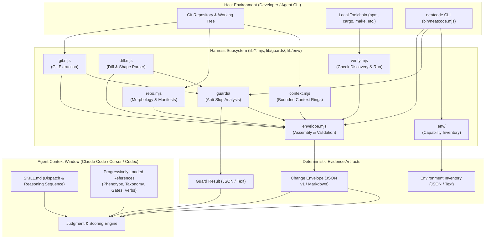
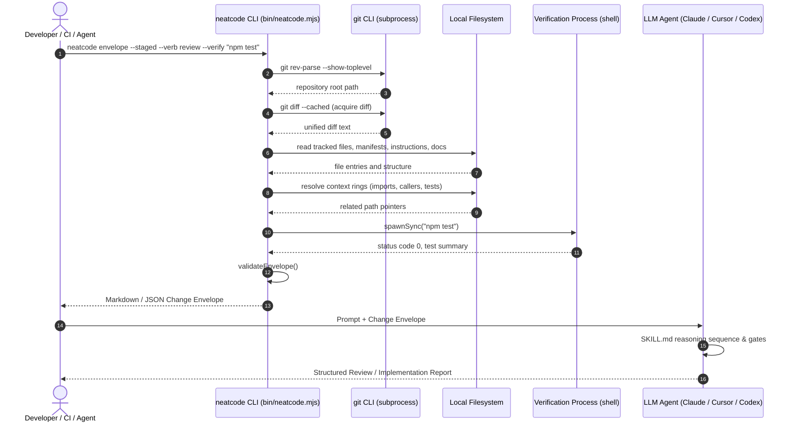
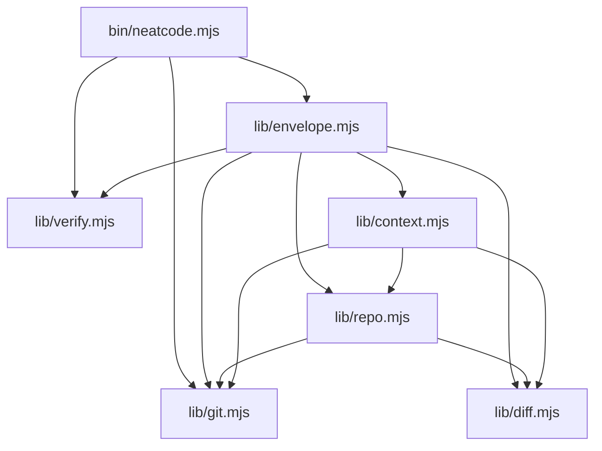

# NeatCode Architecture

This document provides the canonical technical architecture of the NeatCode repository. It defines the structural boundaries, runtime topology, data contracts, and design trade-offs governing the system.

---

## 1. System Identity and High-Level Topology

**NeatCode** is a dual-component engineering judgment system for AI coding assistants. It installs the judgment of an experienced software engineer who has studied the repository into the agent's context window.

The system is split cleanly into two halves:
1. **The Deterministic Evidence Harness** (`bin/neatcode.mjs`, `lib/*.mjs`, `lib/guards/*.mjs`, `lib/env/*.mjs`, `guards/`): A zero-dependency Node.js CLI tool that discovers repository morphology, parses Git diffs, expands bounded context rings, executes declared verification checks, runs deterministic anti-slop guards, inventories machine capabilities, and serializes structured evidence artifacts. It performs **no code quality judgment**.
2. **The Natural Language Skill Kernel** (`skills/neatcode/SKILL.md`, `skills/neatcode/references/**`): A natural-language reasoning protocol loaded into AI coding agents (Claude Code, Cursor, Codex) that ingests the change envelope, applies epistemic discipline, assesses architectural conformance, executes 52 pre-completion gates, and scores changes across 6 critique axes.



---

## 2. Architectural Layers

### Layer 1: Process and I/O Boundary (`bin/neatcode.mjs`)
- **Responsibility**: Command-line argument parsing, environment validation, standard input/output formatting, and process exit code signaling.
- **Invariants**:
  - Contains **zero business logic**. It delegates completely to `lib/envelope.mjs`, `lib/verify.mjs`, `lib/guards/index.mjs`, and `lib/env/index.mjs`.
  - Emits JSON on `--json` and human-readable text/Markdown by default.
  - Exits `0` on success, `1` on execution failure or strict validation failure (`--strict`), and `2` on syntax/usage errors. For `guard`, findings are output, not failure: exit `1` means the run itself failed or `--strict` tripped.
- **Evidence**: [`bin/neatcode.mjs:101-157`](bin/neatcode.mjs#L101-L157).

### Layer 2: Acquisition and Synthesis Harness (`lib/`)
A cluster of cohesive, zero-dependency ES modules:
- [`lib/git.mjs`](lib/git.mjs): Safe interaction with `git` using `child_process.spawnSync` with explicit argument arrays (never a shell string) to prevent command injection.
- [`lib/diff.mjs`](lib/diff.mjs): Unified diff parser extracting modified files, hunks, line counts, renames, and path classifications (`source`, `test`, `docs`, `config`, `asset`, `generated`).
- [`lib/repo.mjs`](lib/repo.mjs): Inspects tracked repository morphology, package manifests, instruction files (`AGENTS.md`, `CLAUDE.md`), architecture claims (`README.md`, `docs/adr/`), workspace configuration, and file size outliers.
- [`lib/context.mjs`](lib/context.mjs): Expands **exactly one bounded context ring** per changed path without whole-repository dumping: owning package, local imports, discoverable callers, and related tests.
- [`lib/verify.mjs`](lib/verify.mjs): Discovers declared proof mechanisms (`package.json`, `Cargo.toml`, `go.mod`, `pyproject.toml`, `Makefile`) and executes operator-requested verification commands with condensed output capture.
- [`lib/envelope.mjs`](lib/envelope.mjs): Orchestrates acquisition modules, validates structural integrity via [`validateEnvelope()`](lib/envelope.mjs#L118-L159), and renders formatted Markdown or JSON.

### Layer 2b: Deterministic Guard Analysis (`lib/guards/`, `guards/`)
- **Responsibility**: Mechanically provable anti-slop signals for JavaScript/TypeScript, Python, Go, and Rust — never engineering verdicts. Normalizes every analyzer into one finding model (`rule_id`, `neatcode_family`, `upstream_rule_id`, `language`, `path`, `line`, `message`, `deterministic: true`) and labels findings against a baseline (`introduced · worsened · exposed · pre-existing · resolved`).
- **Execution model**: JS/TS, Go, and Rust run dependency-free syntactic detectors in-process (`lib/guards/javascript.mjs`, `go.mjs`, `rust.mjs`, adapted from the vendored donor contracts under `guards/*/upstream/`). Python executes the vendored stdlib-only `anti_slop` engine as a `python3` subprocess and normalizes its JSON. A missing runtime or a parse failure is an execution **failure**, never a clean result; vendored reference sources (`guards/*/upstream/`) are excluded from scans by default.
- **Boundary**: establishes facts of the form "this file contains this pattern". Severity, attribution, and remediation belong to the skill (see [`skills/neatcode/references/guards.md`](skills/neatcode/references/guards.md)).

### Layer 2c: Machine Capability Inventory (`lib/env/`)
- **Responsibility**: Deterministic answers to "what agentic and development capabilities are actually available here?" — installed coding agents (79-agent registry adapted from `vercel-labs/skills`), the current executor (env-signal spec from `vercel/detect-agent`, loaded at runtime), configured MCP services with secret redaction, skill roots with shared-location deduplication, and relevant toolchains.
- **Boundary**: establishes facts of the form "binary exists", "config declares Y", "version is X". It never recommends architecture or strategy; the skill consults it during orientation to prefer demonstrated local capability over invented machinery (see [`skills/neatcode/references/environment.md`](skills/neatcode/references/environment.md)).

### Layer 3: Reasoning Protocol & Skill Kernel (`skills/neatcode/SKILL.md`)
- **Responsibility**: Orchestrates how an AI coding assistant thinks through a software modification or inspection task.
- **Structure**:
  - **Frontmatter**: Declares skill name, version, and trigger descriptions.
  - **Disciplines**: Earnedness ([`references/restraint.md`](skills/neatcode/references/restraint.md)), Evidence ([`references/evidence.md`](skills/neatcode/references/evidence.md)), Epistemic Honesty, Canonical Authority, Diff-Relative Fairness, Proportionate Depth.
  - **Depth Ladder**: `Trace` (≤1 file, no behavior change), `Standard` (regular feature/fix), `Deep` (auth, billing, schema, concurrency, published interfaces).
  - **Reasoning Sequence**: Intent $\rightarrow$ Surface $\rightarrow$ Structure $\rightarrow$ Semantics $\rightarrow$ Evidence.
  - **Default Build Flow**: 9 sequential steps ensuring prevention before syntax generation.
  - **Verb Routing**: Dispatches to explicit verbs (`review`, `audit`, `restructure`, `study`, `harden`).

### Layer 4: Reference Modules & Taxonomy (`skills/neatcode/references/`)
Progressively loaded Markdown files containing deep operational rules:
- **Verbs** ([`references/verbs/`](skills/neatcode/references/verbs)): Protocols for review, audit, restructure, study, and harden.
- **Architecture Phenotype** ([`references/architecture/phenotype.md`](skills/neatcode/references/architecture/phenotype.md)): Conformance assessment comparing genotype (claimed) against phenotype (expressed).
- **Failure Taxonomy** ([`references/taxonomy.md`](skills/neatcode/references/taxonomy.md) & 14 sub-family files): Detailed failure patterns, observable signals, risks, exceptions, and corrections.
- **Gates & Critique** ([`references/gates.md`](skills/neatcode/references/gates.md)): 52 pre-completion gates in 8 groups and a 6-axis scoring rubric.

---

## 3. Runtime and Process Topology

NeatCode requires **no running background daemon**, no database, and no network services.



---

## 4. Dependency Architecture and Invariants



### Dependency Invariants
1. **Zero External Runtime Dependencies**: `package.json` contains no `"dependencies"`. All harness operations rely strictly on Node.js built-in modules (`node:fs`, `node:child_process`, `node:path`, `node:os`). The Python guard engine is not a dependency: it is vendored reference code executed opportunistically through the system `python3`, and its absence reports `not-runnable`, never clean.
2. **Subprocess Isolation**: External binaries (`git`, `python3`, version probes) are invoked exclusively via `spawnSync` with explicit arguments array, avoiding shell interpolation vulnerabilities ([`lib/git.mjs:11`](lib/git.mjs#L11)). Verification commands explicitly enable `shell: true` because they are provided directly by the operator ([`lib/verify.mjs:27`](lib/verify.mjs#L27)).
3. **No AST Parsing in the Harness**: Context expansion is deliberately textual and regex-based ([`lib/context.mjs:15-23`](lib/context.mjs#L15-L23)). The guard detectors are likewise syntactic over comment/string-masked source. Full semantic understanding is the agent's responsibility; keeping the harness lightweight and multi-language.
4. **Vendored Sources Are Reference, Not Runtime** (except the Python engine): `guards/*/upstream/` preserves donor implementations for audit and provenance; the executed detectors are NeatCode-owned ports whose deviations are recorded in each `UPSTREAM.md`. Third-party attributions live in [`THIRD_PARTY_NOTICES.md`](THIRD_PARTY_NOTICES.md).
5. **Link Graph Closure**: Every Markdown link inside `skills/neatcode/` must resolve to a valid file on disk, enforced by [`test/skill-integrity.test.mjs`](test/skill-integrity.test.mjs).

---

## 5. Data Architecture: The Change Envelope

The **Change Envelope** is the central data contract of the system. It represents the complete context necessary to evaluate a change without flooding the model with unnecessary repository contents.

```jsonc
{
  "neatcode": { "envelope": 1, "generated": "2026-09-02T20:45:00.000Z" },
  "scope": {
    "verb": "review",
    "mode": "staged",
    "describe": "staged changes vs HEAD",
    "base": "0123456789abcdef",
    "head": null,
    "paths": []
  },
  "intent": "Refactor subscription state handling",
  "change": {
    "summary": {
      "files": 2, "additions": 35, "deletions": 4, "directories": 1,
      "byKind": { "source": 1, "test": 1 },
      "byStatus": { "modified": 2 },
      "touchesTests": true, "touchesGenerated": false
    },
    "files": [ /* path, oldPath, status, kind, additions, deletions, hunks */ ],
    "diff": "diff --git a/src/... b/src/...",
    "diffTruncated": false,
    "diffBytes": 1420
  },
  "repository": {
    "root": "/home/user/project",
    "branch": "main",
    "head": "0123456789abcdef",
    "cleanWorkingTree": true,
    "dirtyPaths": [],
    "tree": { "fileCount": 140, "counts": {}, "directories": [], "topLevel": [] },
    "manifests": ["package.json"],
    "instructions": ["AGENTS.md"],
    "architectureDocs": ["README.md"],
    "workspace": { "markers": [], "packageCount": 1, "monorepo": false },
    "sizeOutliers": []
  },
  "context": [
    {
      "path": "src/billing/state.ts",
      "generated": false,
      "package": { "dir": ".", "manifest": "package.json" },
      "imports": ["src/billing/types.ts"],
      "callers": ["src/billing/resume.ts"],
      "tests": ["src/billing/state.test.ts"]
    }
  ],
  "verification": {
    "declared": [{ "source": "package.json", "command": "npm run test" }],
    "ran": [
      {
        "command": "npm test",
        "ran": true,
        "status": "passed",
        "exitCode": 0,
        "durationMs": 1240,
        "summary": "12 passed"
      }
    ]
  }
}
```

---

## 5b. Data Architecture: Guard Results and Environment Inventory

The **Guard Result** (`ran`, `languages`, `findings`, `resolved`, `failures`, `provenance` counts, `clean`) carries normalized deterministic findings plus the failures that would otherwise masquerade as clean. `clean` is true only when no findings and no failures exist. An opt-in `envelope --guards` run embeds the same structure as the envelope's `guards` section.

The **Environment Inventory** (`current_executor`, `agents[]` with per-agent evidence and `absent→active` status, `services[]` with redacted configs and per-client provenance, `skills` roots, `tools` + guard-engine runnability) carries machine facts with secret values removed at the source. Both artifacts are stable JSON for agents and automation, with a human rendering for operators.

---

## 6. Subsystem Deep Dives

For detailed subsystem specifications, see:
- [CLI and Harness Guide](docs/subsystems/cli-and-harness.md)
- [Envelope Engine](docs/subsystems/envelope-engine.md)
- [Skill Kernel and Reasoning Protocol](docs/subsystems/skill-kernel.md)
- [Architectural Phenotype Engine](docs/subsystems/phenotype-engine.md)
- [Taxonomy and Gate Subsystem](docs/subsystems/taxonomy-and-gates.md)

---

## 7. Source Trail

- [`bin/neatcode.mjs`](bin/neatcode.mjs) — CLI argument dispatch and process boundary.
- [`lib/envelope.mjs`](lib/envelope.mjs) — Change envelope assembly, schema contract, and markdown formatter.
- [`lib/git.mjs`](lib/git.mjs) — Git interaction and revision resolution.
- [`lib/diff.mjs`](lib/diff.mjs) — Diff parsing and file kind classification.
- [`lib/repo.mjs`](lib/repo.mjs) — Repository morphology, manifests, instruction file discovery.
- [`lib/context.mjs`](lib/context.mjs) — One-ring context expansion.
- [`lib/verify.mjs`](lib/verify.mjs) — Verification check discovery and process execution.
- [`lib/guards/index.mjs`](lib/guards/index.mjs) — Guard orchestration, baseline classification, and rendering.
- [`lib/guards/taxonomy.mjs`](lib/guards/taxonomy.mjs) — Language-independent guard families.
- [`lib/guards/javascript.mjs`](lib/guards/javascript.mjs), [`lib/guards/python.mjs`](lib/guards/python.mjs), [`lib/guards/go.mjs`](lib/guards/go.mjs), [`lib/guards/rust.mjs`](lib/guards/rust.mjs) — Language analyzers.
- [`lib/env/index.mjs`](lib/env/index.mjs) — Environment inventory orchestration.
- [`lib/env/detect.mjs`](lib/env/detect.mjs), [`lib/env/executor.mjs`](lib/env/executor.mjs), [`lib/env/services.mjs`](lib/env/services.mjs), [`lib/env/skills.mjs`](lib/env/skills.mjs), [`lib/env/tools.mjs`](lib/env/tools.mjs), [`lib/env/redact.mjs`](lib/env/redact.mjs) — Inventory subsystems.
- [`skills/neatcode/SKILL.md`](skills/neatcode/SKILL.md) — Natural language skill definition and reasoning sequence.
- [`test/skill-integrity.test.mjs`](test/skill-integrity.test.mjs) — Structural integrity guard test suite.
