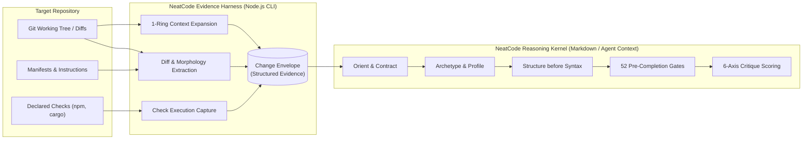

# NeatCode Technical Documentation

Welcome to the NeatCode technical knowledge system. This documentation provides comprehensive architectural depth, implementation details, execution workflows, and reference specifications for NeatCode.

---

## What NeatCode Is

**NeatCode** is a software-engineering skill and zero-dependency harness for AI coding assistants (such as Claude Code, Cursor, and Codex). It installs the judgment of an experienced software engineer who has studied the repository into the agent's working context before it writes code, and again before it claims to be done.

The central thesis of NeatCode is:

> **Code that is reasoned, not generated.**

The problem NeatCode solves is not "ugly" code or syntax errors. Automated linters, formatters, and compilers already catch syntax issues. NeatCode catches **code slop**: code produced by shallow statistical pattern matching that is locally plausible, syntactically correct, and passes tests, but is globally wrong, architecturally unearned, and structurally unmaintainable.

---

## The System in One Picture



---

## The 7 Core Concepts You Need First

1. **The Change Envelope**: A diff alone cannot be judged. The envelope packages the diff with its changed-file context, repository instructions, declared architecture, observed morphology, local callers/dependencies, and verification proof ([`docs/mental-model.md`](mental-model.md)).
2. **Earnedness**: *What concrete constraint earns this complexity?* Any abstraction, indirection, layer, or configuration option without a demonstrable real-world constraint is rejected ([`references/restraint.md`](file:///wsl.localhost/Ubuntu-26.04/home/sprime01/projects/NeatCode/skills/neatcode/references/restraint.md)).
3. **Evidence**: *What supports the claim that this is correct and complete?* Claims of correctness require verified execution. If a check was not run, it must be documented as not run ([`references/evidence.md`](file:///wsl.localhost/Ubuntu-26.04/home/sprime01/projects/NeatCode/skills/neatcode/references/evidence.md)).
4. **Canonical Authority**: Every invariant and piece of business state must have exactly one owner. Adding a second place that validates, normalizes, or transitions state is a defect, even if individually correct ([`docs/vocabulary.md`](vocabulary.md)).
5. **Diff-Relative Fairness**: Every review finding is labeled by its relationship to the change: `introduced`, `worsened`, `exposed`, `pre-existing (blocking)`, `pre-existing (out of scope)`, or `resolved` ([`references/findings.md`](file:///wsl.localhost/Ubuntu-26.04/home/sprime01/projects/NeatCode/skills/neatcode/references/findings.md)).
6. **Repetition Is Not Intent**: A pattern repeated fifty times in a codebase may be an invariant, a reasonable convention, or the fossil record of historical residue. NeatCode explicitly separates them ([`docs/explanation/repetition-vs-intent.md`](explanation/repetition-vs-intent.md)).
7. **Architectural Phenotype**: A codebase has two architectures: the one it claims in its documentation (genotype), and the one its imports and call graph actually express (phenotype). NeatCode measures conformance across six distinct verdicts ([`docs/subsystems/phenotype-engine.md`](subsystems/phenotype-engine.md)).

---

## A Representative Journey: Reviewing a Proposed Change

To see how the entire system cooperates at runtime:

1. **Acquisition**: The developer stages changes and runs:
   ```bash
   neatcode envelope --staged --verb review --verify "npm test"
   ```
   The CLI harness extracts the unified diff, identifies modified files (`src/billing/resume.ts`), discovers `package.json` and `AGENTS.md`, expands direct callers (`src/routes/billing.ts`) and tests (`src/billing/resume.test.ts`), runs `npm test`, and outputs a Markdown envelope.
2. **Ingestion & Orientation**: The developer pastes the envelope into their coding agent with `"neatcode review the staged changes"`. The skill kernel loads the envelope and identifies the change archetype as a *stateful domain operation*.
3. **Reasoning Sequence**: The agent traces the five stages:
   - **Intent**: Did the change do what was asked?
   - **Surface**: Did unexpected files or dependencies enter the diff?
   - **Structure**: Does subscription state transition through the canonical authority?
   - **Semantics**: Is retry of capture idempotent?
   - **Evidence**: Did the test actually exercise the failure path?
4. **Findings & Critique**: The agent detects that `capture()` is retried without an idempotency key. It emits an **S1 · introduced** blocking finding with precise line citations, scores the six critique axes, and produces an actionable report.

---

## Where to Go Next

Navigate this technical knowledge system based on your immediate goal:

### Get Something Done
- [Getting Started Tutorial](getting-started.md) — Install the harness, configure your agent, and run your first review.
- [Worked Recipes](recipes.md) — Six verbatim prompts and outputs across review, audit, restructure, study, and harden.
- [How-To: CI Integration](how-to/integrate-ci.md) — Automate envelope creation in pull request pipelines.
- [How-To: Generate `engineering.md`](how-to/generate-engineering-md.md) — Extract and maintain project engineering profiles.

### Understand the Architecture
- [System Mental Model](mental-model.md) — The philosophy, mechanics, and conceptual boundaries of NeatCode.
- [Architecture Blueprint](../architecture.md) — Process topology, logical layers, dependency invariants, and data contracts.
- [Subsystem Guides](subsystems/) — Detailed design specifications for each harness and skill subsystem.
- [Execution Workflows](workflows/) — Numbered step-by-step traces with sequence diagrams.

### Explore Design Decisions
- [Why Separate Harness and Skill?](explanation/why-harness-skill-split.md) — Why procedural code acquires evidence while natural language judges.
- [Why Zero Dependencies?](explanation/why-zero-dependencies.md) — Architectural restraint in the Node.js implementation.
- [Why Bounded Context Rings?](explanation/why-bounded-context.md) — Managing token attention and preventing LLM context saturation.
- [Nominal Architecture in AI Code](explanation/nominal-architecture.md) — Understanding and catching "architecture cosplay".

### Look Something Up
- [CLI Reference](reference/cli.md) — Exact command syntax, flags, and exit codes.
- [Envelope JSON Schema](reference/envelope-schema.md) — Data schema specification for the Change Envelope.
- [Failure Taxonomy Catalog](reference/taxonomy-catalog.md) — The 14 failure families and diagnostic signals.
- [Gates & Critique Reference](reference/gates-and-critique.md) — The 52 pre-completion gates and 6-axis scoring rubric.
- [Domain Glossary](vocabulary.md) — Repository vocabulary and precise conceptual definitions.
- [Troubleshooting Guide](troubleshooting.md) — Common error symptoms, causes, and diagnostic steps.
- [Documentation Directory](../documentation-map.md) — Complete catalog and Diátaxis classification of every page.
- [Source Traceability Map](../source-map.md) — Map connecting concepts to source files and line numbers.
