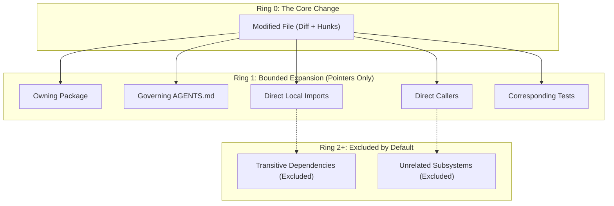

# Explanation: Why Bounded Context Rings?

A common temptation when working with Large Language Models (LLMs) with massive context windows (100k–1M+ tokens) is to dump the entire codebase into the model's prompt.

NeatCode explicitly rejects this approach. Its harness enforces a strict **Bounded Context Expansion** rule: exactly one ring outward from each changed file, returning file pointers rather than file contents.

This document explains the cognitive, computational, and economic rationale behind this constraint.

---

## The Failure Mode: Context Saturation and the "Lost in the Middle" Effect

Transformer-based LLMs do not process 500,000 tokens with uniform fidelity. Attention mechanisms are susceptible to:
1. **The "Lost in the Middle" Phenomenon**: Information placed in the middle of massive context payloads experiences significant retrieval degradation compared to information at the boundaries.
2. **Signal Drowning**: When an agent is handed 40,000 lines of code across 80 files, the subtle signal of a duplicated utility or an unhandled edge case is drowned out by the noise of unrelated business logic.
3. **Instruction Dilution**: As raw codebase tokens increase, the model's adherence to nuanced prompt instructions (such as the 52 pre-completion gates) degrades measurably.

An agent that is given the whole repository does not become more thorough; it becomes a careless pattern-matcher that skims code and misses critical architectural defects.

---

## The 1-Ring Expansion Mechanics

To provide sufficient context without triggering saturation, `lib/context.mjs` expands **exactly one ring** around each modified path:

$$\text{Changed Path} \longrightarrow \begin{cases}
\text{Enclosing Package Manifest} & \text{(identifies available dependencies)} \\
\text{Governing Instructions} & \text{(local AGENTS.md outranks root AGENTS.md)} \\
\text{Direct Local Imports} & \text{(what this file relies on)} \\
\text{Direct Local Callers} & \text{(what calls into this file)} \\
\text{Related Tests} & \text{(where proof is located)}
\end{cases}$$



---

## Pointers vs. File Contents

The context rings emitted by NeatCode do not embed the file bodies of callers or tests. They embed **pointers**:

```markdown
**`src/billing/resume.ts`**
- package: `packages/api` (packages/api/package.json)
- local imports: `src/billing/state.ts`
- likely callers: `src/http/routes/subscriptions.ts`
- related tests: `src/billing/resume.test.ts`
```

### Why Pointers Matter
1. **Deliberate Reading**: When an agent is handed a list of pointers, it must form a specific hypothesis before choosing to open a file:
   > *"I am opening `src/billing/state.ts` to confirm whether `SubscriptionState.transition()` is the sole permitted transition authority."*
   Reading driven by hypothesis is disciplined and thorough. Reading driven by mass dumping is unfocused.
2. **Compact Envelopes**: Change envelopes typically measure between 1,000 and 8,000 tokens, leaving 95%+ of the model's context window open for deep multi-step reasoning, gate evaluation, and critique.

---

## When to Read Further

NeatCode permits an agent to read beyond the first context ring under one strict condition:
> **Read further only when a specific conclusion depends on it, and state in writing which conclusion drove the extra reading.**

Opening thirty files to "be safe" is a failure to form an engineering hypothesis. Opening one specific file to verify a transaction boundary is senior engineering practice.
