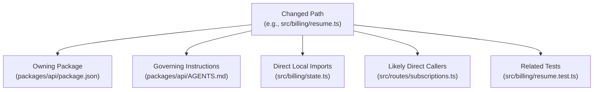

# NeatCode Mental Model

This document articulates the conceptual architecture, core philosophical principles, and operational mechanics of NeatCode. It explains *how* NeatCode views codebases and *why* its reasoning boundaries are designed the way they are.

---

## 1. The Core Problem: Sophisticated Code Slop

AI coding agents rarely write syntax errors. Compilers, linters, and type checkers reject syntax errors immediately.

Instead, AI models excel at generating **code slop**:
> **Code slop:** Plausible code that technically works and has not earned the confidence it projects.

Sophisticated slop does not look like a mess. It wears a suit:
- A clean, modern interface declaration with exactly one implementation.
- A new `normalizeEmail()` utility in a handler, completely unaware that `src/domain/user.ts` has maintained the canonical version for four years.
- A `ProviderManager` class that does nothing except forward every invocation directly to a `ProviderRegistry`.
- An asynchronous retry wrapper `withRetry(3)` placed around an external billing capture that lacks an idempotency key.
- A new test suite written after the implementation that passes against the bug because its assertions merely mirror whatever the code currently produces.

Each of these choices is defensible in isolation. Together, they turn a clean repository into an unmaintainable tangle within six months.

NeatCode exists to install the restraint and memory of an experienced engineer into the agent's context window.

---

## 2. The Architectural Dichotomy: Harness vs. Skill

The most fundamental architectural decision in NeatCode is the strict division of labor between procedural software and natural-language intelligence:

```text
┌────────────────────────────────────────────────────────┐
│                   CLI Harness (Code)                   │
│                                                        │
│  Acquires Git Diffs + Gathers Context Rings + Runs     │
│  Verification Checks -> Emits Structured Evidence      │
│                                                        │
│  Properties: Deterministic · Zero Opinions · No Lying   │
└───────────────────────────┬────────────────────────────┘
                            │
                            ▼ (Change Envelope)
┌────────────────────────────────────────────────────────┐
│                   Skill Kernel (LLM)                   │
│                                                        │
│  Interprets Intent + Evaluates Earnedness + Applies    │
│  52 Gates + Traces Invariants -> Emits Judgment        │
│                                                        │
│  Properties: Semantic · Invariant-Aware · Restrained   │
└────────────────────────────────────────────────────────┘
```

- **The Harness (`bin/neatcode.mjs`, `lib/`)** is written in procedural JavaScript. It gathers, filters, and formats evidence. It **never judges**. There is no field in the envelope schema for "assumed to pass" or "code quality rating".
- **The Skill (`skills/neatcode/SKILL.md`, `references/`)** is written in Markdown. It embodies engineering judgment. It decides whether an abstraction is earned, whether an authority is duplicated, and whether the evidence actually proves the claim.

If this boundary were collapsed — for instance, by writing procedural AST rules to detect bad patterns — the system would devolve into another fragile linter. If the boundary were collapsed in the other direction — having the LLM grep the repository itself — the agent would quickly drown in token limits, lose focus, and hallucinate file contents.

---

## 3. The Two Governing Questions

NeatCode applies two questions relentlessly across every verb and change:

### 1. Earnedness
> **What concrete constraint earns this complexity?**

A concrete constraint is an observable fact in the world:
- A second implementation exists *today* in this repository.
- A published public interface that external consumers rely on.
- A measured benchmark showing a direct implementation violates a latency budget.
- A security boundary requiring strict process isolation.

Speculative justifications (*"we might need this later"*, *"it makes it more extensible"*, *"it separates concerns"*) do not earn complexity. If no concrete constraint can be named, the abstraction is removed.

### 2. Evidence
> **What supports the claim that this is correct and complete?**

Claims in software engineering exist in one of three states:
1. **Verified**: A command was executed, you observed its exit status, and the test exercised the regression.
2. **Inspected**: You read the source code and traced the data flow, but nothing executed.
3. **Assumed**: You believe it works because it is plausible.

All three states are acceptable in an engineering report, but **only Verified may appear without an explicit label**. Assumptions must be called out explicitly. Unrun checks must be reported as `not-run`.

---

## 4. The Change Envelope & Bounded Context Expansion

A unified diff alone cannot be judged:

```diff
+ export class SubscriptionManager {
+   constructor(private registry: SubscriptionRegistry) {}
+   get(id: string) { return this.registry.get(id); }
+ }
```

Is `SubscriptionManager` unearned pass-through slop, or is it a deliberate public facade isolating internal registry mutations? A diff cannot answer that question.

To judge the diff, you need the **Change Envelope**:
$$\text{Envelope} = \text{Intent} + \text{Diff} + \text{Morphology} + \text{Bounded Context} + \text{Instructions} + \text{Verification Proof}$$

### The Bounded Context Expansion Rule
Loading the whole repository into the LLM context window causes context saturation: attention mechanisms degrade, key instructions are lost, and hallucination rates rise.

NeatCode expands **exactly one ring outward** from each changed file:



Crucially, the harness emits **pointers** (file paths) for callers and tests, not their full file contents. The agent decides which specific files to open based on targeted hypotheses, keeping reading deliberate and tokens small.

---

## 5. Architectural Phenotype: Genotype vs. Phenotype

Borrowing from evolutionary biology:
- **Genotype (Claimed Architecture)**: What the project claims about itself in `README.md`, `ARCHITECTURE.md`, ADRs, and folder names.
- **Phenotype (Expressed Architecture)**: What the project actually expresses through its import statements, call graphs, and shared data models.

Architectural vocabulary (*"hexagonal"*, *"clean architecture"*, *"event-driven"*) is evidence of **intent**, not evidence of conformance.

When evaluating a codebase, NeatCode returns one of six verdicts:
1. **Conformant**: Imports, boundaries, and logic obey the claimed design.
2. **Partially Conformant**: Holds generally, with bounded exceptions.
3. **Nominal**: The vocabulary exists in folder names, but the architectural property is absent (e.g., domain modules import database clients directly).
4. **Contradictory**: Stated claims actively conflict with each other or with code reality.
5. **Unverifiable**: The claim is unfalsifiable ("our code is clean").
6. **Coherent Emergent Alternative**: The code has diverged from the documentation, but has formed a coherent, consistent alternative architecture. In this case, **the documentation is wrong**, which is the cheaper fix.

---

## 6. The Finding Model & Provenance

When reviewing code, NeatCode refuses to bill a patch for pre-existing debt in the file it touched. Every finding carries an explicit **provenance**:

| Provenance Label | Meaning |
| :--- | :--- |
| **`introduced`** | Created by this change; did not exist before. |
| **`worsened`** | Existed before; this change made it wider, more expensive, or harder to undo. |
| **`exposed`** | Untouched by the change, but made reachable or load-bearing for the first time. |
| **`pre-existing (blocking)`** | Pre-existing debt that makes completing this change safely impossible. |
| **`pre-existing (out of scope)`** | Real debt in the neighborhood, but not this patch's responsibility. |
| **`resolved`** | Cleaned up or fixed by this change. |

This eliminates the two most common reviewer failures: blaming a contributor for legacy debt they did not create, and allowing new debt to be laundered because a file was already messy.

---

## 7. Next Reading

- [Domain Glossary](vocabulary.md) — Exact definitions of project-specific vocabulary.
- [Architecture Blueprint](../architecture.md) — Detailed technical structure of the software.
- [The 52 Pre-Completion Gates](reference/gates-and-critique.md) — The pre-completion revision checklist.
- [Traceability Matrix](../source-map.md) — Connecting conceptual models to source lines.
