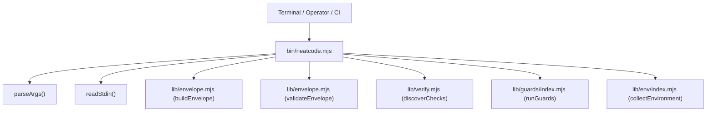

# Subsystem: CLI and Harness

The **CLI and Harness** subsystem provides the command-line boundary and execution entry point for NeatCode. It handles argument tokenization, process standard I/O streams, and delegates evidence assembly to underlying modules.

---

## Purpose
The CLI exists to provide a zero-dependency, deterministic terminal interface for acquiring repository evidence, discovering verification proof, running deterministic anti-slop guards, and inventorying machine capabilities without embedding evaluation opinions.

---

## Responsibilities
- **Argument Parsing**: Tokenizes CLI flags, scope modes, verification commands, guard options, environment options, and output formats.
- **Process Orchestration**: Invokes `buildEnvelope()`, `discoverChecks()`, `runGuards()`, or `collectEnvironment()` based on user subcommands.
- **Serialization**: Emits validated Markdown or JSON envelopes, formatted guard findings, or environment inventories to standard output.
- **Exit Code Management**: Translates execution results into standardized exit codes (`0`, `1`, `2`).

---

## Non-Responsibilities
- **Does not judge code quality**: Contains no rules determining whether a change is good or bad.
- **Does not perform Git operations directly**: Delegates all subprocess execution to [`lib/git.mjs`](../../lib/git.mjs).
- **Does not parse diffs**: Delegates diff tokenization to [`lib/diff.mjs`](../../lib/diff.mjs).

---

## Position in the System



---

## Core Abstractions

### `parseArgs(argv)`
A custom, zero-dependency command-line argument tokenizer located at [`bin/neatcode.mjs`](../../bin/neatcode.mjs). It processes argv arrays sequentially and populates an options dictionary:
```javascript
const opts = {
  command: null,                       // 'envelope' | 'checks' | 'guard' | 'environment'
  source: { mode: 'working-tree', paths: [] },
  verb: 'review',                      // review | audit | restructure | study | harden | build
  intent: null,
  verify: [],                          // Array of shell commands to execute
  guards: false,                       // Include deterministic guard evidence in envelope
  json: false,                         // Emit JSON vs human-readable text
  strict: false,                       // Non-zero exit on problems or guard findings
  maxDiffBytes: undefined,
  guardPaths: [],
  guardLanguages: [],
  guardAll: false,
  staged: false,
  baseline: null,
  envSections: [],
};
```

### Exit Codes
- `0`: Successful execution with valid output. For `guard`, findings are output, not failure: exit `0` means the scan completed cleanly.
- `1`: Subprocess error, unhandled exception, strict validation failure (`--strict`), incomplete guard run (missing runtime or unparseable file), or `--strict` guard findings present.
- `2`: Command-line usage error (unknown flag, missing flag argument, invalid subcommand).

---

## Internal Operation

When invoked with `neatcode envelope [options]`:
1. `parseArgs(process.argv.slice(2))` validates all flags.
2. If `--stdin` is specified, `readStdin()` buffers file descriptor `0` via `readFileSync(0, 'utf8')`.
3. `buildEnvelope()` is called with the resolved scope, verification commands, and optional `--guards` flag.
4. `validateEnvelope()` performs structural sanity checks on the resulting object.
5. If problems exist, warnings are printed to `process.stderr`.
6. If `--strict` is set and problems were discovered, the process exits with code `1`.
7. The envelope is rendered as JSON (`JSON.stringify(envelope, null, 2)`) or Markdown (`toMarkdown(envelope)`) and written to `process.stdout`.

When invoked with `neatcode checks`:
1. Resolves repository root using `repoRoot(process.cwd())`.
2. Calls `discoverChecks(root)`.
3. Prints tab-delimited commands and sources (e.g. `npm run test\t(package.json)`).

When invoked with `neatcode guard [options]`:
1. Validates languages and resolves target paths and baseline revision (`--staged` or `--baseline <rev>`).
2. Calls `runGuards({ root, paths, languages, baseline, includeGenerated, includeVendored })`.
3. Formats output as human-readable text via `formatGuardsHuman()` or structured JSON.
4. Exits with code `1` if execution failures occurred or if `--strict` was specified and findings exist; otherwise exits `0`.

When invoked with `neatcode environment [options]`:
1. Collects installed agents, current executor, MCP services, skill roots, and toolchains via `collectEnvironment()`.
2. Formats output as human-readable text via `formatEnvironmentHuman()` or structured JSON.
3. Exits with code `0`.

---

## State
The CLI subsystem is strictly **stateless**. It reads the local filesystem and executes Git queries dynamically; it maintains no caches or persistent background state.

---

## Failure Modes
- **Unknown Option**: Throws an error (`unknown option: --foo`) and exits with code `2`.
- **Missing Required Argument**: `need(rest, flag)` detects missing parameters and exits with code `2`.
- **Validation Failure with `--strict`**: Returns exit code `1` if structural errors occur during envelope assembly or if guard findings are detected under `--strict`.

---

## Extension Points
- **New CLI Flags**: Add flag cases in [`bin/neatcode.mjs`](../../bin/neatcode.mjs).
- **New Output Formats**: Extend serialization logic in [`bin/neatcode.mjs`](../../bin/neatcode.mjs).

---

## Source Trail
- [`bin/neatcode.mjs`](../../bin/neatcode.mjs) — CLI entrypoint, flag parsing, and execution routing.
- [`lib/guards/index.mjs`](../../lib/guards/index.mjs) — Guard orchestration entrypoint.
- [`lib/env/index.mjs`](../../lib/env/index.mjs) — Environment capability inventory entrypoint.
- [`test/envelope.test.mjs`](../../test/envelope.test.mjs) — CLI integration test specs.

