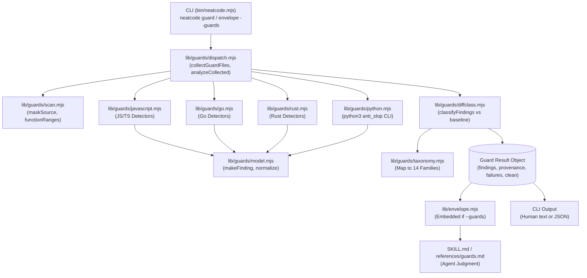

# Subsystem: Deterministic Guards

The **Deterministic Guards** subsystem provides language-specific, mechanically provable anti-slop checks for JavaScript/TypeScript, Python, Go, and Rust. It identifies syntactic and structural code smells without requiring heavyweight external dependencies or third-party AST parser installations.

---

## Purpose
The subsystem establishes objective, verifiable facts of the form *"this file contains this specific pattern at line L"* before or during agent review. It provides evidence for engineering critique without presuming to make final quality verdicts.

---

## Responsibilities
- **Multi-Language Detection**: Executes targeted syntactic analyzers across JavaScript/TypeScript, Python, Go, and Rust.
- **Masked-Source Scanning**: Scans code with comments and string literals blanked out to prevent false matches on non-executable tokens while preserving line and column offsets.
- **Unified Finding Normalization**: Transforms diverse language analyzer outputs into a standardized finding schema mapped to NeatCode's 14 language-independent failure taxonomy families.
- **Diff-Relative Baseline Classification**: Categorizes findings as `introduced`, `worsened`, `exposed`, `pre-existing`, or `resolved` against a Git commit baseline.
- **Change Envelope Integration**: Provides an opt-in `--guards` flag for `neatcode envelope` to enrich the change envelope with deterministic guard facts.
- **Strict Gating for CI**: Offers a `--strict` mode in `neatcode guard` that exits non-zero if any finding exists.

---

## Non-Responsibilities
- **Does not render final quality verdicts**: Establishes facts, not judgments. A finding indicates a pattern is present; whether the pattern is justified or acceptable in context is judged by the skill kernel.
- **Does not introduce npm dependencies**: JS/TS, Go, and Rust detectors run entirely in-process using Node.js built-ins and regex-based scanning over masked source.
- **Does not auto-fix code**: Output is strictly informational and diagnostic.

---

## Position in the System



---

## Core Abstractions

### 1. Unified Finding Model (`lib/guards/model.mjs`)
Every finding emitted by any analyzer is normalized into a strict structure:

```jsonc
{
  "rule_id": "neatcode/typescript/no-chained-type-assertions",
  "neatcode_family": "type-laundering",
  "upstream_rule_id": "no-chained-type-assertions",
  "language": "typescript",
  "path": "src/services/billing.ts",
  "line": 42,
  "column": 15,
  "message": "chained type assertion (x as A as B) launder types through an unrelated intermediate",
  "deterministic": true,
  "severity": "error",
  "source": "neatcode",
  "provenance": "introduced"
}
```

### 2. Masked-Source Scanning (`lib/guards/scan.mjs`)
To avoid false positives in comments, strings, character literals, and template strings without shipping an entire AST parser:
- `maskSource(source, { templates: true })` replaces string contents and comments with whitespace characters of identical length, preserving newlines, character indices, and column positions.
- Template literal interpolation expressions (`${...}`) are kept unmasked because they contain executable code.
- Go raw strings (backticks) and Rust raw byte strings are masked cleanly.

### 3. Language Analyzers
- **JavaScript / TypeScript** ([`lib/guards/javascript.mjs`](../../lib/guards/javascript.mjs)):
  Detects known-value widening, chained type assertions (`as unknown as T`), broad contracts (`any`/`unknown` parameters and returns), empty object spreads (`{ ...(condition && { key }) }`), runtime `typeof` on widened evidence, and module mocking in unit tests.
- **Python** ([`lib/guards/python.mjs`](../../lib/guards/python.mjs)):
  Executes the vendored, zero-dependency Python package `anti_slop` ([`guards/python/upstream/anti_slop/`](../../guards/python/upstream/anti_slop)) via system `python3` subprocess. Catches `Any` aliases, swallowed exceptions, mutable dataclass defaults, f-string logging, UTC now misuse, and debug prints.
- **Go** ([`lib/guards/go.mjs`](../../lib/guards/go.mjs)):
  Adapted from upstream staticcheck/antislop rules G01–G08, G10, G11, G13. Detects unannotated single-result assertions, untyped map laundering, `any` parameter widening without contract comments, ad-hoc type switches, unjustified `reflect` usage, and production `os.Exit`/`panic`.
- **Rust** ([`lib/guards/rust.mjs`](../../lib/guards/rust.mjs)):
  Enforces 9 NeatCode-owned rules defined in [`guards/rust/UPSTREAM.md`](../../guards/rust/UPSTREAM.md): `unsafe` blocks without preceding `// SAFETY:` comments, `std::mem::transmute` without safety justification, `dyn Any` downcasting, broad dynamic errors in library code, `TypeId` dispatch, and raw `panic!` in non-test code.

### 4. Diff-Relative Baseline Classification (`lib/guards/diffclass.mjs`)
When running against a baseline (e.g. `neatcode guard --staged` or `--baseline main`):
1. Runs the analyzers over the current working tree or staged content.
2. Extracts file contents at the baseline revision using `git show <rev>:<path>`.
3. Runs the analyzers over the baseline content.
4. Categorizes findings into:
   - `introduced`: Finding exists now but was absent in the baseline.
   - `worsened`: Finding rule existed on this path in the baseline, but occurs more times now.
   - `exposed`: Finding was untouched, but surrounding code changed its reach.
   - `pre-existing`: Finding already existed in the baseline on this path.
   - `resolved`: Finding was present in baseline but is eliminated in current code.

---

## Envelope Integration

When `neatcode envelope --guards` is passed:
1. The envelope engine identifies non-generated modified paths.
2. If any path belongs to a supported language (`.js`, `.ts`, `.py`, `.go`, `.rs`), it runs `runGuards({ root, paths: changedPaths, baseline: baseRev })`.
3. The resulting findings and provenance counts are stored in the envelope's top-level `guards` field.
4. Markdown envelopes format a dedicated `## Deterministic Guards` section highlighting introduced and pre-existing findings.

---

## Skill Judgment Boundary

The deterministic harness and the natural-language skill maintain a strict division of responsibility:
- **Harness**: Detects the literal pattern deterministically (`deterministic: true`).
- **Skill Kernel**: Reads [`skills/neatcode/references/guards.md`](../../skills/neatcode/references/guards.md) and the matching ecosystem overlay ([`ecosystems/typescript.md`](../../skills/neatcode/references/ecosystems/typescript.md), [`ecosystems/python.md`](../../skills/neatcode/references/ecosystems/python.md), [`ecosystems/go.md`](../../skills/neatcode/references/ecosystems/go.md), [`ecosystems/rust.md`](../../skills/neatcode/references/ecosystems/rust.md)) to decide:
  1. Is this finding blocking or informational?
  2. Does a legitimate repository constraint earn an exemption?
  3. How should the author rectify the defect without breaking the contract?

---

## Failure Modes
- **Missing Python Runtime**: If Python files are scanned but `python3` is not installed on PATH, the run records an execution failure (`language: "python", reason: "runtime-not-runnable"`). The scan **never passes silently**.
- **Unparseable Files**: A syntax error in a Python or other guarded file records a failure in `failures[]` and sets `clean: false`.
- **Exclusion of Vendored Code**: The engine automatically ignores `guards/*/upstream/`, `node_modules`, `vendor/`, and build outputs unless `--all` is passed.
