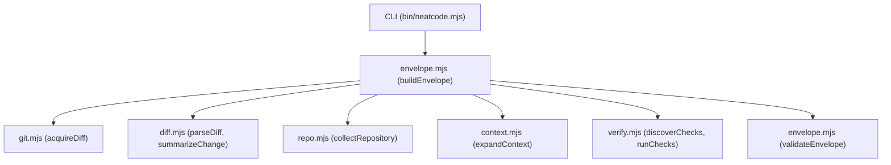

# Subsystem: Envelope Engine

The **Envelope Engine** is the core evidence synthesis pipeline within NeatCode's Node.js harness. It coordinates Git diff acquisition, repository morphology analysis, bounded context ring expansion, and verification check execution.

---

## Purpose
The subsystem transforms raw, uncoordinated repository state into a compact, structurally validated, and deterministic **Change Envelope** that an AI coding agent can reliably evaluate without being overwhelmed by repository size.

---

## Responsibilities
- **Diff Acquisition**: Extracts unified diffs across working trees, index staging, commits, ranges, and patch files.
- **Diff & Shape Parsing**: Tokenizes unified diffs into file entries, hunks, line statistics, and path classifications.
- **Morphology Extraction**: Catalogs directory structures, identifies package manifests, detects instruction files, and highlights god-module size outliers.
- **1-Ring Context Expansion**: Traces local dependencies, discovers direct callers, and pairs related tests for every changed file.
- **Verification Execution**: Runs operator-specified verification commands and captures exit codes, durations, and output summaries.
- **Structural Integrity Validation**: Audits the resulting envelope against versioned schema invariants.

---

## Non-Responsibilities
- **Does not evaluate code correctness or architecture conformance**: Strictly limits its output to observable evidence.
- **Does not perform full-repo AST parsing**: Employs lightweight, language-agnostic textual scanning to remain fast and multi-language.
- **Does not mutate repository source files**: Acquisition operations are read-only.

---

## Position in the System



---

## Core Abstractions

### `buildEnvelope(options)`
Located in [`lib/envelope.mjs:33-112`](file:///wsl.localhost/Ubuntu-26.04/home/sprime01/projects/NeatCode/lib/envelope.mjs#L33-L112). Coordinates the entire acquisition flow:
```javascript
export function buildEnvelope(options = {}) {
  // 1. Resolve repository root
  // 2. Acquire diff based on source.mode (working-tree, staged, commit, range, etc.)
  // 3. Parse diff into files, hunks, and shape summary
  // 4. Collect repository morphology, manifests, instructions, and size outliers
  // 5. Expand one context ring per changed path
  // 6. Discover declared checks and execute requested verification commands
  // 7. Assemble and return Envelope v1 object
}
```

### `validateEnvelope(envelope)`
Located in [`lib/envelope.mjs:118-159`](file:///wsl.localhost/Ubuntu-26.04/home/sprime01/projects/NeatCode/lib/envelope.mjs#L118-L159). The deterministic guard rail verifying envelope well-formedness:
- Asserts `envelope.neatcode.envelope === 1`.
- Validates scope modes against `SCOPE_MODES`.
- Confirms non-empty `repository.root`.
- Validates file statuses (`added`, `modified`, `deleted`, `renamed`, `copied`).
- Asserts that diff text parsed to files (preventing silent acquisition failures).
- Checks status validity of verification runs (`passed`, `failed`, `timeout`, `not-run`).

### Path Classification (`classifyPath(path)`)
Located in [`lib/diff.mjs:22-29`](file:///wsl.localhost/Ubuntu-26.04/home/sprime01/projects/NeatCode/lib/diff.mjs#L22-L29). Classifies paths into six functional kinds:
- `generated`: Lockfiles, vendor directories, minified bundles, protobuf outputs.
- `test`: Files matching `test/`, `spec/`, `_test.go`, `test_*.py`, etc.
- `asset`: Binary media, images, fonts, archives.
- `docs`: Markdown, text, and `docs/` trees.
- `config`: Dotfiles, YAML, TOML, JSON configuration files.
- `source`: Primary implementation code.

---

## Internal Operation

### Bounded Context Ring Walk (`expandContext`)
Located in [`lib/context.mjs:110-127`](file:///wsl.localhost/Ubuntu-26.04/home/sprime01/projects/NeatCode/lib/context.mjs#L110-L127). For each non-generated path in the diff:
1. **Owning Package**: Climbs directories upward looking for the nearest manifest (`package.json`, `Cargo.toml`, etc.) via [`owningPackage()`](file:///wsl.localhost/Ubuntu-26.04/home/sprime01/projects/NeatCode/lib/repo.mjs#L129-L142).
2. **Local Imports**: Regex-scans import statements (`import ... from './...'`, `require()`, `from . import`, `use crate::`) and resolves targets against tracked repository files via [`localImports()`](file:///wsl.localhost/Ubuntu-26.04/home/sprime01/projects/NeatCode/lib/context.mjs#L40-L62).
3. **Discoverable Callers**: Searches tracked source files for occurrences of the module's basename stem via [`likelyCallers()`](file:///wsl.localhost/Ubuntu-26.04/home/sprime01/projects/NeatCode/lib/context.mjs#L79-L93).
4. **Related Tests**: Locates test files sharing the module's stem via [`relatedTests()`](file:///wsl.localhost/Ubuntu-26.04/home/sprime01/projects/NeatCode/lib/context.mjs#L96-L104).

---

## State
The engine is stateless. It reads working tree state and temporary Git stdout buffers dynamically.

---

## Failure Modes
- **Diff Parser Failure**: If unified diff headers cannot be parsed, `validateEnvelope` fails with `"diff text is present but no files parsed out of it"`.
- **Git Binary Absent**: `git()` throws `GitError` if `git` is missing from system `PATH`.
- **Diff Truncation**: Diffs larger than `maxDiffBytes` (default 400KB) are sliced cleanly with `diffTruncated: true`.

---

## Extension Points
- **New Manifest Types**: Add manifest filenames to `MANIFESTS` in [`lib/repo.mjs:10-15`](file:///wsl.localhost/Ubuntu-26.04/home/sprime01/projects/NeatCode/lib/repo.mjs#L10-L15).
- **New Ecosystem Import Syntax**: Add regex patterns to `IMPORT_PATTERNS` in [`lib/context.mjs:15-23`](file:///wsl.localhost/Ubuntu-26.04/home/sprime01/projects/NeatCode/lib/context.mjs#L15-L23).
- **New Check Sources**: Add manifest inspection logic to `discoverChecks` in [`lib/verify.mjs:56-89`](file:///wsl.localhost/Ubuntu-26.04/home/sprime01/projects/NeatCode/lib/verify.mjs#L56-L89).

---

## Source Trail
- [`lib/envelope.mjs`](file:///wsl.localhost/Ubuntu-26.04/home/sprime01/projects/NeatCode/lib/envelope.mjs) — Envelope builder, validator, and Markdown renderer.
- [`lib/git.mjs`](file:///wsl.localhost/Ubuntu-26.04/home/sprime01/projects/NeatCode/lib/git.mjs) — Git execution wrappers and revision resolution.
- [`lib/diff.mjs`](file:///wsl.localhost/Ubuntu-26.04/home/sprime01/projects/NeatCode/lib/diff.mjs) — Diff parser and change surface summarizer.
- [`lib/repo.mjs`](file:///wsl.localhost/Ubuntu-26.04/home/sprime01/projects/NeatCode/lib/repo.mjs) — Repository morphology, manifests, instructions, and workspace detection.
- [`lib/context.mjs`](file:///wsl.localhost/Ubuntu-26.04/home/sprime01/projects/NeatCode/lib/context.mjs) — Bounded context ring resolution.
- [`lib/verify.mjs`](file:///wsl.localhost/Ubuntu-26.04/home/sprime01/projects/NeatCode/lib/verify.mjs) — Verification runner and command discovery.
