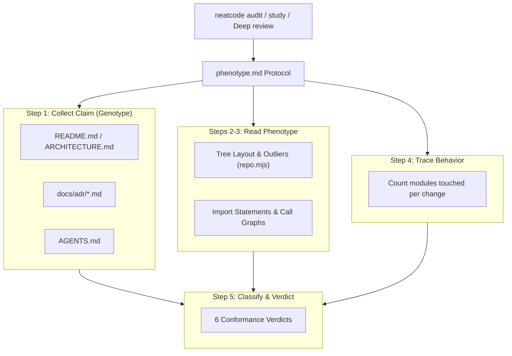

# Subsystem: Architectural Phenotype Engine

The **Architectural Phenotype Engine** is NeatCode's conformance assessment protocol. Documented in [`skills/neatcode/references/architecture/phenotype.md`](file:///wsl.localhost/Ubuntu-26.04/home/sprime01/projects/NeatCode/skills/neatcode/references/architecture/phenotype.md) and [`signatures.md`](file:///wsl.localhost/Ubuntu-26.04/home/sprime01/projects/NeatCode/skills/neatcode/references/architecture/signatures.md), it compares what a codebase claims about its architecture against what its physical imports and call graphs actually express.

---

## Purpose
The subsystem detects architectural drift, broken layer boundaries, and "nominal architecture" (codebases that wear architectural folder names like costumes while violating the underlying engineering contracts).

---

## Responsibilities
- **Genotype Collection**: Gathers claimed architectural rules from `README.md`, ADRs (`docs/adr/`), `ARCHITECTURE.md`, and instruction files (`AGENTS.md`).
- **Phenotype Observation**: Evaluates physical file layout, directory depth, dependency directions, fan-in hubs, and cross-boundary type leakage.
- **Behavior Trace Analysis**: Measures true modularity by counting how many distinct modules must be modified to alter a single business behavior.
- **Verdict Determination**: Classifies the system into one of six canonical conformance verdicts.
- **Dual Correction Strategy**: Offers two remediation paths when code and docs diverge: either restore code conformance or update the documentation to match reality.

---

## Non-Responsibilities
- **Does not impose foreign architectural styles**: Does not force clean architecture or hexagonal design onto a repository that chose a simple transaction script.
- **Does not run external AST linters**: Relies on import statement grep scans and structural tracing within the agent's reasoning pass.

---

## Position in the System

---

## The Six Conformance Verdicts

| Verdict | Meaning | Actionable Consequence |
| :--- | :--- | :--- |
| **`Conformant`** | Claim is expressed and enforced. Boundaries hold and dependencies obey stated rules. | System is healthy; continue building on established patterns. |
| **`Partially Conformant`** | Claim holds generally with identified, bounded exceptions. | Name specific exceptions; determine if they are documented pragmatism or accidental drift. |
| **`Nominal`** | Architectural vocabulary is present, but functional properties are absent (e.g. `domain/` exists but imports `infra/db`). | High-risk state. Either enforce boundaries with dependency tests or simplify the directory structure. |
| **`Contradictory`** | Stated claims conflict with each other, or the code directly reverses the claim. | Reconcile the conflict with maintainers before proceeding with new feature work. |
| **`Unverifiable`** | Claim is subjective or unfalsifiable (*"clean and modular"*). | Clarify the invariant into falsifiable structural terms. |
| **`Coherent Emergent Alternative`** | Code does not match the documentation, but expresses a consistent, working alternative design. | **The documentation is wrong.** Update the documentation rather than refactoring working code. |

---

## The 5-Step Protocol Walkthrough

### Step 1: Collect the Claim (Genotype)
The agent quotes exact sentences with line numbers from documentation:
> *"Domain logic must not depend on infrastructure" — `README.md:44`, restated in `AGENTS.md:31`.*

### Step 2: Read Visible Morphology
The agent analyzes directory depth, test placement, file-size outliers, and recent commit gravity from the change envelope.

### Step 3: Read Dependency Phenotype
The agent inspects physical import statements to verify dependency arrows:
- Does `src/domain/` import from `src/infra/` or third-party ORM libraries?
- Is there a cycle between packages?
- Are foreign external types (e.g., Stripe SDK types) translated at boundary adapters or allowed to leak into core entities?

### Step 4: Trace Behavior Placement
The agent picks 2–3 representative operations and traces their call stack:
- Where are decisions made vs. where is data merely forwarded?
- *How many distinct files must be edited to change one behavior?* If adding a field to an entity requires modifying five horizontal layers, the claim of "vertical slice architecture" is nominal.

### Step 5: Compare, Classify, and Report
The agent emits a structured verdict block including the claim, observed facts, verdict, consequences, and concrete corrections.

---

## Detecting Nominal Architecture (Cosplay Checks)

NeatCode provides instant grep tests for common nominal patterns ([`phenotype.md:105-117`](file:///wsl.localhost/Ubuntu-26.04/home/sprime01/projects/NeatCode/skills/neatcode/references/architecture/phenotype.md#L105-L117)):
- **Layered / Clean**: Nominal when `domain/` imports `infra/`.
- **Hexagonal (Ports & Adapters)**: Nominal when production instantiates concrete adapter classes directly, reserving the interface port only for test stubs.
- **Event-Driven**: Nominal when events are dispatched synchronously and immediately awaited in the same request thread (a function call wearing an event costume).
- **Microservices**: Nominal when independent services share a single database schema and read each other's tables directly.

---

## The Shared-Module Gravity Well
The engine pays special attention to generic folders (`utils/`, `common/`, `shared/`, `core/`, `lib/`). When these modules accumulate domain entities or import from feature modules, the architecture has collapsed into a disguised monolith hub.

---

## Source Trail
- [`skills/neatcode/references/architecture/phenotype.md:1-149`](file:///wsl.localhost/Ubuntu-26.04/home/sprime01/projects/NeatCode/skills/neatcode/references/architecture/phenotype.md#L1-L149) — The conformance protocol, checks, and reporting template.
- [`skills/neatcode/references/architecture/signatures.md`](file:///wsl.localhost/Ubuntu-26.04/home/sprime01/projects/NeatCode/skills/neatcode/references/architecture/signatures.md) — Architectural signatures for layered, hexagonal, pipeline, and event architectures.
- [`lib/repo.mjs:109-115`](file:///wsl.localhost/Ubuntu-26.04/home/sprime01/projects/NeatCode/lib/repo.mjs#L109-L115) — Architecture documentation discovery in the harness.
