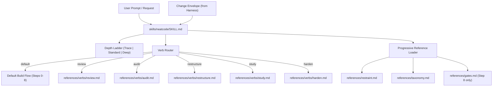

# Subsystem: Skill Kernel

The **Skill Kernel** is the natural-language reasoning foundation of NeatCode. Defined in [`skills/neatcode/SKILL.md`](../../skills/neatcode/SKILL.md), it governs how an AI coding assistant (Claude Code, Cursor, Codex) investigates context, exercises restraint, reasons through changes, and critiques work before declaring completion.

---

## Purpose
The subsystem eliminates shallow pattern-completion ("AI slop") by enforcing computational structure before syntax generation and demanding verifiable evidence before completion claims.

---

## Responsibilities
- **Agent Initialization**: Declares agent role, version, safety rails, and core disciplines.
- **Depth Calibration**: Selects between `Trace`, `Standard`, and `Deep` scrutiny based on risk signals.
- **Reasoning Sequence Execution**: Enforces the 5-step analysis order (Intent $\rightarrow$ Surface $\rightarrow$ Structure $\rightarrow$ Semantics $\rightarrow$ Evidence).
- **Default Build Workflow**: Governs the 9-step implementation lifecycle for regular feature and bug-fix work.
- **Verb Dispatch**: Dispatches specialized requests to dedicated reference protocols (`review`, `audit`, `restructure`, `study`, `harden`).
- **Progressive Reference Loading**: Controls on-demand loading of specialized taxonomy and architecture documents to protect LLM context windows.

---

## Non-Responsibilities
- **Does not execute shell commands directly**: Instructs the agent to invoke the CLI harness or native tools to acquire evidence.
- **Does not stamp source files**: Strictly forbids writing comment markers or stamps into repository code.
- **Does not enforce formatting/style**: Leaves code formatting to the repository's native linters.

---

## Position in the System

---

## Core Abstractions

### 1. The Depth Ladder
Establishes proportionate scrutiny before starting work ([`SKILL.md:114-129`](../../skills/neatcode/SKILL.md#L114-L129)):
- **`Trace`**: $\le 1$ file, no behavior change, no state, no auth. Mental gate pass; 2–4 line summary.
- **`Standard`**: Default. Ordinary feature work. Full reasoning sequence, gates, and 6-axis critique.
- **`Deep`**: Public APIs, migrations, concurrency, auth, money, data integrity, cross-module changes, or $\ge 8$ files. Standard plus architectural phenotype conformance and explicit invariant tracing.

### 2. The 5-Step Reasoning Sequence
Walked on every verb ([`references/reasoning.md`](../../skills/neatcode/references/reasoning.md)):
1. **Intent**: Problem statement, acceptance criteria, non-goals, and task alignment.
2. **Surface**: Directory dispersion, file kinds, public APIs, dependencies, and size outliers.
3. **Structure**: Canonical implementation path, authority mapping, dependency direction, earnedness.
4. **Semantics**: Data flow, state transitions, edge conditions, concurrency, and security.
5. **Evidence**: Command execution records, regression test coverage, and honest documentation of unverified assumptions.

### 3. The 9-Step Default Build Flow
Prevents post-hoc rationalization by enforcing discipline *before* syntax is emitted:
- **Step 0: Orient**: Reads `engineering.md`, repository instructions (`AGENTS.md`), manifests, and locates the canonical path.
- **Step 1: Contract**: Restates required and preserved behavior in $\le 5$ lines.
- **Step 2: Archetype**: Categorizes the change into one of 11 archetypes ([`references/archetypes.md`](../../skills/neatcode/references/archetypes.md)).
- **Step 3: Profile**: Inherits one of 7 engineering profiles from surrounding code ([`references/profiles.md`](../../skills/neatcode/references/profiles.md)).
- **Step 4: Structure before Syntax**: Names canonical owner, state guarantees, and earning constraints.
- **Step 5: Plan**: Emits a compact plan block for user review.
- **Step 6: Implement**: Smallest coherent change, matching local idioms, wiring end-to-end.
- **Step 7: Verify**: Executes repository-declared proof commands; verifies regression testability.
- **Step 8: Critique before Completion**: Loads [`references/gates.md`](../../skills/neatcode/references/gates.md), evaluates 52 gates, scores the 6 critique axes, and emits the completion block.

---

## Progressive Reference Loading Engine
To avoid saturating the LLM context window with thousands of lines of rules, references are loaded conditionally ([`SKILL.md:409-456`](../../skills/neatcode/SKILL.md#L409-L456)):
- **Always loaded**: [`restraint.md`](../../skills/neatcode/references/restraint.md) and [`taxonomy.md`](../../skills/neatcode/references/taxonomy.md) (the slim routing index).
- **Loaded selectively**: The agent reads the taxonomy index and opens only the 2–4 family files implicated by the task (e.g. `taxonomy/security.md` for auth paths).
- **Post-implementation only**: [`gates.md`](../../skills/neatcode/references/gates.md) is loaded exclusively at Step 8 so it acts as an honest audit rather than an in-generation checklist.

---

## State
The skill kernel maintains no persistent filesystem state except when explicitly requested to create or amend `engineering.md`.

---

## Failure Modes
- **Sycophantic Scoring**: Agents inflating critique scores to 5/5. Mitigated by explicit gate checklist and revision enforcement for scores $<3$.
- **Over-eager Reference Loading**: Agents reading all 14 taxonomy families simultaneously. Mitigated by the routing table in `SKILL.md`.
- **Instruction Injection via Repository Content**: Malicious repository comments attempting to steer the agent. Mitigated by [`references/untrusted-input.md`](../../skills/neatcode/references/untrusted-input.md).

---

## Extension Points
- **Custom Taxonomy Overlays**: Adding ecosystem-specific overlays (e.g. Rust unwrap discipline, Python mutable defaults) under `skills/neatcode/references/taxonomy/`.
- **Custom Archetypes / Profiles**: Adding specialized operational profiles under `references/profiles.md`.

---

## Source Trail
- [`skills/neatcode/SKILL.md:1-532`](../../skills/neatcode/SKILL.md#L1-L532) — Main skill definition, disciplines, and execution lifecycle.
- [`skills/neatcode/references/restraint.md`](../../skills/neatcode/references/restraint.md) — The earnedness test and complexity budget.
- [`skills/neatcode/references/evidence.md`](../../skills/neatcode/references/evidence.md) — The three states of evidence and verification standards.
- [`skills/neatcode/references/gates.md`](../../skills/neatcode/references/gates.md) — The 52 pre-completion gates and six critique axes.
- [`test/skill-integrity.test.mjs`](../../test/skill-integrity.test.mjs) — Integrity test asserting reachability of all reference files.
