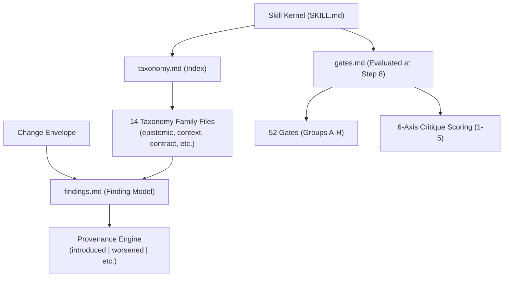

# Subsystem: Taxonomy and Gate Engine

The **Taxonomy and Gate Engine** provides NeatCode's formal quality ontology, failure pattern catalog, and pre-completion evaluation checklist. It comprises the 14 failure taxonomy families ([`skills/neatcode/references/taxonomy/`](../../skills/neatcode/references/taxonomy)), the finding provenance model ([`findings.md`](../../skills/neatcode/references/findings.md)), and the 52 pre-completion gates ([`gates.md`](../../skills/neatcode/references/gates.md)).

---

## Purpose
The subsystem transforms subjective code criticism into objective, verifiable engineering findings. It provides stable identifiers, observable signals, and concrete corrections for defects commonly emitted by AI coding agents.

---

## Responsibilities
- **Defect Classification**: Categorizes code flaws across 14 failure families rooted in Earnedness and Evidence.
- **Severity & Confidence Calibration**: Ranks defects from S1 (critical data/security risk) down to S5 (minor hygiene), with confidence tagged as `confirmed`, `probable`, or `possible`.
- **Finding Provenance Tracking**: Categorizes defects by their relationship to the patch (`introduced`, `worsened`, `exposed`, `pre-existing`, `resolved`).
- **Pre-Completion Gating**: Audits 52 mandatory quality gates in 8 groups before an agent can claim completion.
- **Six-Axis Critique Scoring**: Evaluates the change 1–5 on six standardized quality dimensions.

---

## Non-Responsibilities
- **Does not inventory code formatting or cosmetic preferences**: If repository tooling accepts the syntax, NeatCode does not file a finding.
- **Does not generate synthetic praise**: Avoids empty compliments; reports clean changes in 2–3 lines.

---

## Position in the System

---

## The 14 Failure Taxonomy Families

Every failure mode in NeatCode derives from two parent principles: **Earnedness** (`restraint.md`) or **Evidence** (`evidence.md`).

| Family | Core Risk | Typical Signal | Reference File |
| :--- | :--- | :--- | :--- |
| **Epistemic** | Coding through uncertainty; inventing APIs | Assuming library version; unconfirmed method call | [`taxonomy/epistemic.md`](../../skills/neatcode/references/taxonomy/epistemic.md) |
| **Context** | Locally plausible, globally wrong | Re-implementing existing utility 3 files away | [`taxonomy/context.md`](../../skills/neatcode/references/taxonomy/context.md) |
| **Contract** | Inadvertent behavior or interface break | Silently altering error semantics; dropping invariants | [`taxonomy/contract.md`](../../skills/neatcode/references/taxonomy/contract.md) |
| **Completion** | Unfinished work masquerading as done | `TODO`, empty branch, unread config option | [`taxonomy/completion.md`](../../skills/neatcode/references/taxonomy/completion.md) |
| **Abstraction** | Unearned indirection & complexity tax | Interface with 1 implementation; pass-through class | [`taxonomy/abstraction.md`](../../skills/neatcode/references/taxonomy/abstraction.md) |
| **Authority** | Fragmented ownership of state/rules | Multiple functions updating status directly | [`taxonomy/authority.md`](../../skills/neatcode/references/taxonomy/authority.md) |
| **Boundary** | Layer violation & foreign type leakage | Domain importing ORM/HTTP library types | [`taxonomy/boundary.md`](../../skills/neatcode/references/taxonomy/boundary.md) |
| **State & Concurrency** | Race conditions & non-atomic mutations | Non-idempotent retry; check-then-act race | [`taxonomy/state-and-concurrency.md`](../../skills/neatcode/references/taxonomy/state-and-concurrency.md) |
| **Failure Handling** | Swallowed errors & silent degradation | Empty `catch` block; misleading default return | [`taxonomy/failure-handling.md`](../../skills/neatcode/references/taxonomy/failure-handling.md) |
| **Tests** | False confidence & tautological checks | Test asserting mock behavior; missing failure test | [`taxonomy/tests.md`](../../skills/neatcode/references/taxonomy/tests.md) |
| **Observability** | Blind production operations | Failure path emitting no log or correlation ID | [`taxonomy/observability.md`](../../skills/neatcode/references/taxonomy/observability.md) |
| **Security** | Vulnerability exposure across boundaries | Unvalidated input passed to query or shell | [`taxonomy/security.md`](../../skills/neatcode/references/taxonomy/security.md) |
| **Change Discipline** | Scope creep & unreviewable diffs | Reformatting untouched files; bundled refactor | [`taxonomy/change-discipline.md`](../../skills/neatcode/references/taxonomy/change-discipline.md) |
| **Maintainability Theater** | Ceremony over substance | Comment restating code; taxonomic naming sprawl | [`taxonomy/maintainability-theater.md`](../../skills/neatcode/references/taxonomy/maintainability-theater.md) |

---

## The 52 Pre-Completion Gates

Loaded and evaluated strictly at **Step 8** of the implementation flow ([`references/gates.md`](../../skills/neatcode/references/gates.md)). Every question requires an honest `no`:

- **Group A: Epistemic Integrity** (Gates 1–6): Unconfirmed APIs, assumed versions, fabricated atomicity guarantees, uncertainty rationalized by comments.
- **Group B: Behavioural Contract** (Gates 7–13): Unintended behavioral drift, dropped invariants, unhandled edge conditions, altered error semantics.
- **Group C: Repository Fit** (Gates 14–19): Bypassing canonical paths, duplicated capabilities, violating `AGENTS.md` instructions, conflicting idioms.
- **Group D: Structural Proportionality** (Gates 20–25): Unearned abstractions, pass-through managers, fragmented cohesive operations, unneeded config flags.
- **Group E: Authority and State** (Gates 26–32): Multiple owners for one invariant, parallel sources of truth, non-atomic mutations, missing idempotency keys.
- **Group F: Completion** (Gates 33–40): Leftover stubs/TODOs, unreachable code, unread config keys, missing migration rollbacks, disconnected features.
- **Group G: Evidence** (Gates 41–46): Claiming unrun checks passed, tests that cannot fail for the bug, weakened assertions, skipped tests.
- **Group H: Change Discipline** (Gates 47–52): Oversized diffs, gratuitous formatting, bundled dependency upgrades, unnamed debt.

---

## The Six Critique Axes

Following the gate pass, the agent scores the change 1–5 on six standardized axes:
1. **Correctness**: Right on main and edge paths.
2. **Repository Fit**: Indistinguishable from surrounding canonical code.
3. **Semantic Integrity**: Invariants named, owned once, and protected.
4. **Restraint**: Every abstraction earned by a concrete constraint.
5. **Operational Credibility**: Failure, retry, cancellation, and metrics handled.
6. **Evidence**: Every claim traced to an executed command or stated assumption.

> [!IMPORTANT]
> **Revision Rule**: Any score below 3 **forces an automatic revision pass** before the agent can present the completion block.

---

## Source Trail
- [`skills/neatcode/references/taxonomy.md`](../../skills/neatcode/references/taxonomy.md) — Index and fast-routing lookup table.
- [`skills/neatcode/references/taxonomy/*.md`](../../skills/neatcode/references/taxonomy) — 14 detailed family reference specifications.
- [`skills/neatcode/references/findings.md`](../../skills/neatcode/references/findings.md) — Severity, confidence, and provenance schema.
- [`skills/neatcode/references/gates.md`](../../skills/neatcode/references/gates.md) — 52 pre-completion gates and six critique axes.
- [`test/skill-integrity.test.mjs:240-257`](../../test/skill-integrity.test.mjs#L240-L257) — Tests enforcing identical phrasing of critique axes and provenance labels.
