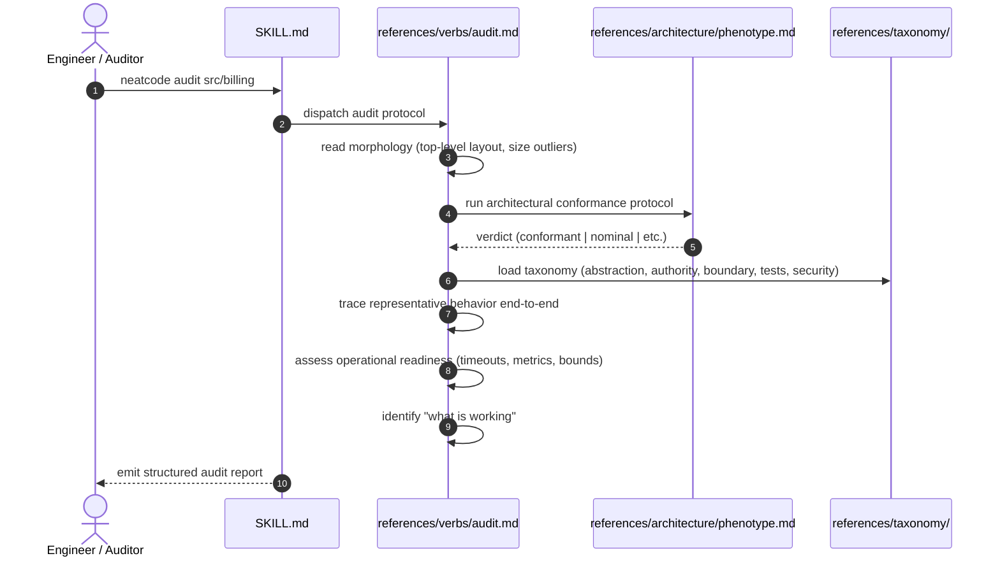

# Workflow: Auditing Existing Code

This workflow details how the `neatcode audit <target>` verb evaluates an existing codebase, subsystem, or module without a diff and without editing files.

---

## Summary
`neatcode audit` answers *"what is the health and architectural state of this code?"* It inspects directory morphology, executes the architectural phenotype conformance protocol, evaluates implementation quality against implicated taxonomy families, checks operational readiness, and ranks findings strictly by consequence.

---

## Sequence Diagram

---

## Execution Stages

1. **Scope and Morphology**:
   - Evaluates directory layout, recent commit activity (`git log --oneline -30`), test placement, and size distribution.
2. **Architecture Conformance**:
   - Collects documented claims from `README.md`, ADRs, and `AGENTS.md`.
   - Inspects physical imports to test whether boundaries hold.
   - Emits an explicit conformance verdict (e.g. **Nominal** if domain imports database adapters).
3. **Implementation Quality**:
   - Evaluates authority boundaries (who mutates status).
   - Identifies unearned abstractions (interfaces with one implementation).
   - Traces at least one representative flow end-to-end.
4. **Operational Readiness**:
   - Checks timeout policies on external dependencies.
   - Audits observability: do error paths log context and increment counters?
   - Checks resource bounds: connection pools, queue depths.
5. **Report Formulation**:
   - Leads with structural findings and architecture conformance.
   - Lists ranked findings (S1 through S5).
   - **Includes "What is working"**: Highlights load-bearing correct modules so readers can weigh criticisms properly.

---

## Source Trail
- [`skills/neatcode/references/verbs/audit.md`](../../skills/neatcode/references/verbs/audit.md) — Audit verb specification.
- [`skills/neatcode/references/architecture/phenotype.md`](../../skills/neatcode/references/architecture/phenotype.md) — Conformance protocol.
