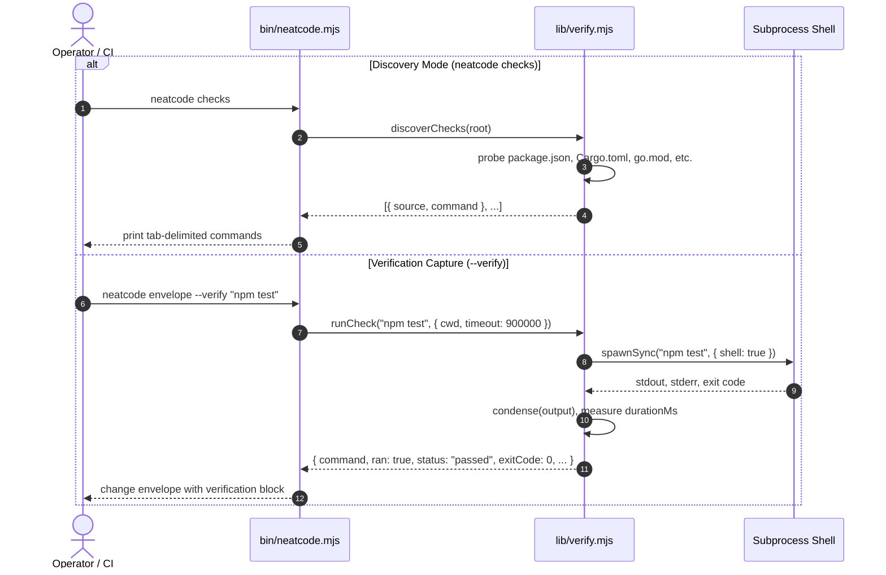

# Workflow: Check Discovery and Verification Execution

This workflow documents how NeatCode identifies what a repository considers proof of correctness and how it executes and records verification runs.

---

## Summary
NeatCode answers the question *"what does this repository accept as proof?"* through two mechanisms:
1. **Passive Discovery (`neatcode checks`)**: Inspects repository manifests (`package.json`, `Cargo.toml`, `go.mod`, `pyproject.toml`, `Makefile`) without executing anything.
2. **Active Capture (`neatcode envelope --verify <cmd>`)**: Executes operator-specified verification commands in a subprocess, tracks elapsed runtime, captures exit status, condenses verbose logs, and embeds the results in the Change Envelope.

---

## Sequence Diagram

---

## Detailed Execution Steps

### Part 1: Check Discovery (`discoverChecks`)
Located in [`lib/verify.mjs:56-89`](file:///wsl.localhost/Ubuntu-26.04/home/sprime01/projects/NeatCode/lib/verify.mjs#L56-L89):
1. **Node.js**: Checks for `package.json`. If present, parses JSON and probes `scripts` for standard targets: `test`, `lint`, `typecheck`, `types`, `check`, `build`, `format`. Discovered scripts are registered as `npm run <name>`.
2. **Rust**: Checks for `Cargo.toml`. If present, registers `cargo test` and `cargo clippy --all-targets --all-features`.
3. **Go**: Checks for `go.mod`. If present, registers `go test ./...` and `go vet ./...`.
4. **Python**: Checks for `pyproject.toml`. If present, registers `pytest`.
5. **Makefile**: Checks for `Makefile`. Probes targets using regex `^(test|lint|check|ci):` and registers `make <target>`.

### Part 2: Verification Execution (`runCheck`)
Located in [`lib/verify.mjs:23-46`](file:///wsl.localhost/Ubuntu-26.04/home/sprime01/projects/NeatCode/lib/verify.mjs#L23-L46):
1. Marks start timestamp `started = Date.now()`.
2. Calls `child_process.spawnSync(command, { cwd, shell: true, timeout: 900_000, maxBuffer: 32MB })`.
   - *Security Note*: `shell: true` is deliberate here because verification command strings are provided directly by the human operator, not interpolated from repository contents.
3. Computes `durationMs = Date.now() - started`.
4. Handles outcome states:
   - **Timeout**: If `run.error.code === 'ETIMEDOUT'`, returns `status: "timeout"`, `exitCode: null`.
   - **Not Run**: If process failed to spawn (e.g. command not found), returns `status: "not-run"`, `exitCode: null`.
   - **Passed**: If `run.status === 0`, returns `status: "passed"`, `exitCode: 0`.
   - **Failed**: If `run.status !== 0`, returns `status: "failed"`, `exitCode: run.status`.
5. **Output Condensation (`condense`)**: Filters empty lines. If output exceeds 20 lines, keeps the first 14 lines, appends `… N lines elided …`, and attaches the final 5 lines.

---

## State Changes
- Verification commands may compile code or run tests depending on the command executed.
- NeatCode's internal harness state remains immutable.

---

## Failure Branches
- **Manifest Syntax Error**: Malformed `package.json` JSON is safely swallowed with `try/catch` without crashing discovery ([`lib/verify.mjs:67`](file:///wsl.localhost/Ubuntu-26.04/home/sprime01/projects/NeatCode/lib/verify.mjs#L67)).
- **Subprocess Timeout**: Execution exceeding 15 minutes is terminated cleanly and recorded as `timeout`.

---

## Source Trail
- [`lib/verify.mjs:10-16`](file:///wsl.localhost/Ubuntu-26.04/home/sprime01/projects/NeatCode/lib/verify.mjs#L10-L16) — `condense()` log formatter.
- [`lib/verify.mjs:23-46`](file:///wsl.localhost/Ubuntu-26.04/home/sprime01/projects/NeatCode/lib/verify.mjs#L23-L46) — `runCheck()` execution controller.
- [`lib/verify.mjs:56-89`](file:///wsl.localhost/Ubuntu-26.04/home/sprime01/projects/NeatCode/lib/verify.mjs#L56-L89) — `discoverChecks()` manifest probe.
- [`bin/neatcode.mjs:120-129`](file:///wsl.localhost/Ubuntu-26.04/home/sprime01/projects/NeatCode/bin/neatcode.mjs#L120-L129) — CLI `checks` command handler.
