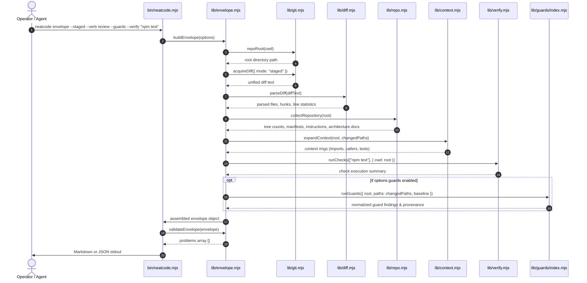

# Workflow: Envelope Acquisition

This workflow traces the deterministic extraction and assembly of a **Change Envelope** from user command initiation to JSON/Markdown emission.

---

## Summary
The operator or agent executes `neatcode envelope [scope] [options]`. The CLI parses scope flags, invokes Git to extract the raw unified diff, scans repository morphology and instructions, resolves one-ring context expansion for each changed file, executes requested verification commands, optionally runs deterministic anti-slop guards (`--guards`), audits the envelope against schema invariants, and streams the structured result to `stdout`.

---

## Sequence Diagram

---

## Detailed Execution Sequence

1. **Invocation & Argument Parsing**:
   - `bin/neatcode.mjs` executes in Node.js ($\ge 20$).
   - `parseArgs(argv)` resolves the target scope (`--staged`, `--working-tree`, `--commit`, `--range`, etc.), target verb (`--verb review`), intent (`--intent ...`), verification commands (`--verify`), and optional guard flag (`--guards`).
2. **Repository Root Discovery**:
   - `repoRoot()` runs `git rev-parse --show-toplevel`. If the current directory is not within a Git worktree, a `GitError` is raised.
3. **Diff Acquisition**:
   - `acquireDiff()` executes `git diff --no-color --find-renames --no-ext-diff --cached` via `child_process.spawnSync`.
   - If `--max-diff-bytes` is exceeded, the raw diff string is truncated and flagged with `diffTruncated: true`.
4. **Diff Tokenization & Shape Analysis**:
   - `parseDiff()` scans diff headers, hunk boundaries (`@@ -old,len +new,len @@`), and additions/deletions.
   - `classifyPath()` categorizes each file as `source`, `test`, `docs`, `config`, `asset`, or `generated`.
   - `summarizeChange()` calculates directory dispersion and identifies if tests or generated files were touched.
5. **Morphology & Intent Discovery**:
   - `collectRepository()` inspects tracked files, finds package manifests (`package.json`, `Cargo.toml`), instruction files (`AGENTS.md`, `CLAUDE.md`), architecture files (`README.md`, `docs/adr/`), and detects monorepo markers.
   - `sizeOutliers()` identifies files with large byte sizes that may represent god modules.
6. **Bounded Context Expansion**:
   - For each modified path, `expandContext()` walks outward:
     - Detects the nearest `owningPackage()`.
     - Scans `localImports()` via regex without full-repo AST parsing.
     - Performs a stem regex search across tracked source files to discover `likelyCallers()`.
     - Matches colocated or mirrored test files via `relatedTests()`.
7. **Verification Capture**:
   - `discoverChecks()` probes manifests for declared test scripts.
   - If `--verify` commands were specified, `runChecks()` executes each via `child_process.spawnSync`, measures elapsed time, and captures condensed output.
8. **Deterministic Guard Pass (Optional)**:
   - If `--guards` is specified, `runGuards()` evaluates changed paths in supported languages against the scope baseline (`HEAD` or base commit), categorizing findings by provenance (`introduced`, `pre-existing`, etc.).
9. **Validation & Emission**:
   - `validateEnvelope()` checks schema integrity, including guard result constraints.
   - `toMarkdown()` or `JSON.stringify()` serializes the envelope to `process.stdout`.

---

## State Changes
- **No persistent filesystem state is modified.**
- A child process execution log may be created temporarily by verification commands if the user specified `--verify`.

---

## Failure Branches
- **Not in a Git repo**: Exits with code 1; writes `GitError` to `stderr`.
- **Bad range specification**: Throws `GitError: not a commit range: <range>` and exits with code 1.
- **Diff parsed to zero files**: When diff text exists but no files parse, `validateEnvelope()` reports an acquisition error. If `--strict` is set, exits with code 1.
- **Guard execution failure**: If `--guards` was requested but an analyzer crashed or a required runtime is absent, `validateEnvelope` fails validation.

---

## Source Trail
- [`bin/neatcode.mjs`](../../bin/neatcode.mjs) — Execution dispatch.
- [`lib/envelope.mjs`](../../lib/envelope.mjs) — Main `buildEnvelope` algorithm.
- [`lib/git.mjs`](../../lib/git.mjs) — Git diff acquisition.
- [`lib/diff.mjs`](../../lib/diff.mjs) — Unified diff parser.
- [`lib/context.mjs`](../../lib/context.mjs) — Bounded context expansion.
- [`lib/guards/index.mjs`](../../lib/guards/index.mjs) — Deterministic guards orchestration.
