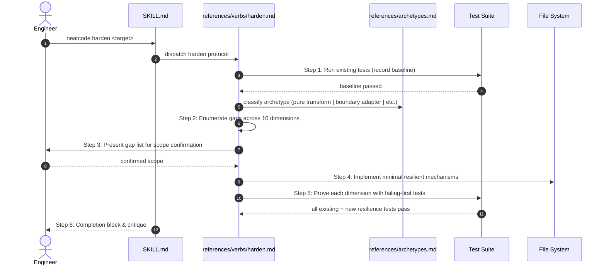

# Workflow: Hardening for Production Credibility

This workflow details how the `neatcode harden <target>` verb transforms happy-path code into production-credible implementations.

---

## Summary
`neatcode harden` operates on code that works under ideal conditions but lacks resilience under real-world operational pressure (slow networks, duplicate deliveries, concurrency races, timeouts, and cancellations). The structure of the code is preserved; **completeness is added**. Every added hardening dimension is proved with a corresponding test that would fail without it.

---

## Sequence Diagram

---

## Execution Stages

### 1. Establish the Baseline
Runs existing test suites. Hardening must never break happy-path functionality; the baseline guarantees non-regression.

### 2. Enumerate Gaps Across 10 Dimensions
The agent evaluates the code against the dimensions warranted by its **archetype** (a pure transformation needs edge cases only; an orchestration flow needs nearly all):
1. **Edge Cases**: Empty, zero, negative, single-element, maximum, overflow, unicode, timezone boundaries.
2. **Idempotency**: Unique constraint, idempotency keys, conditional writes for duplicate deliveries.
3. **Concurrency & Ordering**: Atomic transactions, read-modify-write protection, lock discipline.
4. **Cancellation**: `AbortSignal`, cancellation token propagation, cleanup in `finally`/`defer`.
5. **Recovery & Rollback**: Safe failure states, compensation steps, atomic rollback.
6. **Timeouts & Resource Bounds**: Deadlines on all external I/O, queue and buffer ceilings, jittered retries.
7. **Observability**: Structured logs with correlation IDs, error counters, health probes.
8. **Security Boundaries**: Input sanitization, authorization checks *before* unsafe use, secret redaction.
9. **Migrations**: Expand-then-contract patterns, backward/forward schema compatibility windows.
10. **Production Wiring**: Dependency injection bindings, configuration defaults, route registration.

### 3. Confirm the Scope
Presents a ranked gap list to the user before touching code, noting any change that alters observable failure status (e.g. returning 502 instead of silent success).

### 4. Implement Resilient Mechanisms
Applies the smallest change per gap, using native repository infrastructure (existing loggers, retry helpers) rather than importing heavy new dependencies.

### 5. Prove It with Tests
Every added hardening mechanism must be paired with a test:
- **Idempotency**: Deliver twice $\rightarrow$ assert exactly one effect.
- **Timeout**: Stub a slow socket $\rightarrow$ assert client aborts at deadline.
- **Cancellation**: Abort mid-flight $\rightarrow$ assert cleanup and no database write.
- **Security**: Send hostile payload $\rightarrow$ assert early rejection before downstream calls.

---

## Source Trail
- [`skills/neatcode/references/verbs/harden.md`](file:///wsl.localhost/Ubuntu-26.04/home/sprime01/projects/NeatCode/skills/neatcode/references/verbs/harden.md) — Harden verb protocol.
- [`skills/neatcode/references/archetypes.md`](file:///wsl.localhost/Ubuntu-26.04/home/sprime01/projects/NeatCode/skills/neatcode/references/archetypes.md) — Archetype definitions governing dimension applicability.
