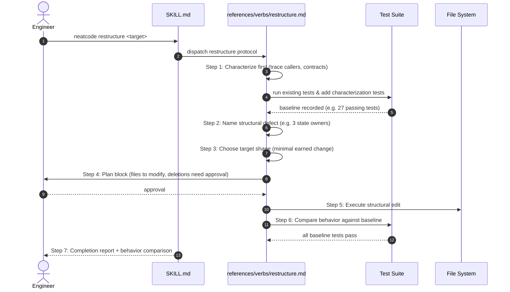

# Workflow: Restructuring Weak Implementations

This workflow details how the `neatcode restructure <target>` verb replaces an implementation strategy while strictly preserving behavioral intent.

---

## Summary
`neatcode restructure` replaces *how* code is built while preserving *what* it does. It explicitly refuses uncharacterized rewrites. It begins by establishing a behavioral baseline with characterization tests, names the precise structural failure, plans the minimal structural change, executes the edit, and proves that 100% of baseline tests pass.

---

## Sequence Diagram

---

## Execution Stages

### 1. Characterize First
> *"Without a behavioral baseline, 'preserves behavior' is a wish."*
The agent reads the target, traces all callers, and runs existing tests. If edge behaviors are uncovered, the agent writes **characterization tests** first (in a separate commit) to pin current behavior, including its quirks.

### 2. Name the Structural Defect
The agent states the failure in one crisp sentence from the taxonomy (e.g., *"Subscription status is updated directly in three separate modules, bypassing the audit logger"*).

### 3. Choose the Target Shape
Selects the narrowest change that fixes the defect:
- Restores canonical authority to one owner.
- Removes unearned wrappers or pass-through classes.
- Inverts bad dependency directions.

### 4. Emit the Plan Block
Presents the plan to the user:
- Target failure.
- Invariants to preserve.
- Exact files to modify or add.
- Explicit confirmation requested for any file deletions.

### 5. Execute the Restructure
Performs behavior-preserving structural moves first. Keeps the diff compact and reviewable.

### 6. Compare Behavior
Runs the baseline tests. **Every characterization test must pass unchanged.** Any discrepancy must be explicitly justified (e.g. an intentional bug fix agreed upon in the plan).

---

## Source Trail
- [`skills/neatcode/references/verbs/restructure.md`](file:///wsl.localhost/Ubuntu-26.04/home/sprime01/projects/NeatCode/skills/neatcode/references/verbs/restructure.md) — Restructure verb protocol.
- [`skills/neatcode/references/restraint.md`](file:///wsl.localhost/Ubuntu-26.04/home/sprime01/projects/NeatCode/skills/neatcode/references/restraint.md) — Earnedness test and removal test.
