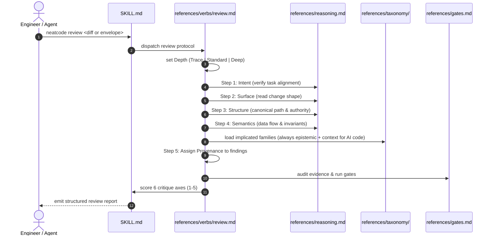

# Workflow: Reviewing a Proposed Change

This workflow documents how the `neatcode review` verb operates when evaluating a proposed patch or pull request.

---

## Summary
`neatcode review` evaluates a proposed change centered on a unified diff read through repository context. It operates in **read-only** mode (no code edits). It traverses the five reasoning stages, classifies every finding with an explicit provenance label (`introduced`, `worsened`, `exposed`, `pre-existing`, `resolved`), audits verification evidence, and outputs a structured review report.

---

## Sequence Diagram

---

## Execution Stages

### 1. Acquire and Set Depth
- Reads the change envelope or diff.
- Sets depth based on risk:
  - `Trace`: mechanical renames, typo fixes.
  - `Standard`: ordinary features or fixes.
  - `Deep`: changes touching auth, payments, database migrations, concurrency, or $\ge 8$ files.

### 2. Walk the Reasoning Sequence
- **Intent**: Verifies whether the diff solves the stated task or wandered into adjacent refactors.
- **Surface**: Checks lines added/deleted, file kinds, and directory dispersion.
- **Structure**: Confirms whether modifications extend the existing canonical authority or opened a second redundant path.
- **Semantics**: Analyzes error handling, nullability, concurrency, and security boundaries.
- **Evidence**: Checks whether added tests fail without the patch, or whether assertions are tautological.

### 3. Load Failure Taxonomy Families
For agent-authored patches, the reviewer always loads [`taxonomy/epistemic.md`](file:///wsl.localhost/Ubuntu-26.04/home/sprime01/projects/NeatCode/skills/neatcode/references/taxonomy/epistemic.md) and [`taxonomy/context.md`](file:///wsl.localhost/Ubuntu-26.04/home/sprime01/projects/NeatCode/skills/neatcode/references/taxonomy/context.md) to detect invented APIs and duplicated utilities.

### 4. Assign Provenance
Every defect is labeled to guarantee fairness:
- `introduced`: New defect created by this diff.
- `worsened`: Existing defect exacerbated by this diff.
- `exposed`: Untouched defect made reachable by this diff.
- `pre-existing (blocking)`: Pre-existing defect that prevents safe merging.
- `pre-existing (out of scope)`: Surrounding debt not caused by this patch.
- `resolved`: Existing defect fixed by this patch.

### 5. Gate Audit & Critique
Runs the pre-completion gates from [`references/gates.md`](file:///wsl.localhost/Ubuntu-26.04/home/sprime01/projects/NeatCode/skills/neatcode/references/gates.md), evaluates the six critique axes (correctness, repository fit, semantic integrity, restraint, operational credibility, evidence), and emits the standardized review block.

---

## Source Trail
- [`skills/neatcode/references/verbs/review.md`](file:///wsl.localhost/Ubuntu-26.04/home/sprime01/projects/NeatCode/skills/neatcode/references/verbs/review.md) — Review verb specification.
- [`skills/neatcode/references/reasoning.md`](file:///wsl.localhost/Ubuntu-26.04/home/sprime01/projects/NeatCode/skills/neatcode/references/reasoning.md) — Five-step reasoning protocol.
- [`skills/neatcode/references/findings.md`](file:///wsl.localhost/Ubuntu-26.04/home/sprime01/projects/NeatCode/skills/neatcode/references/findings.md) — Severity and provenance rules.
