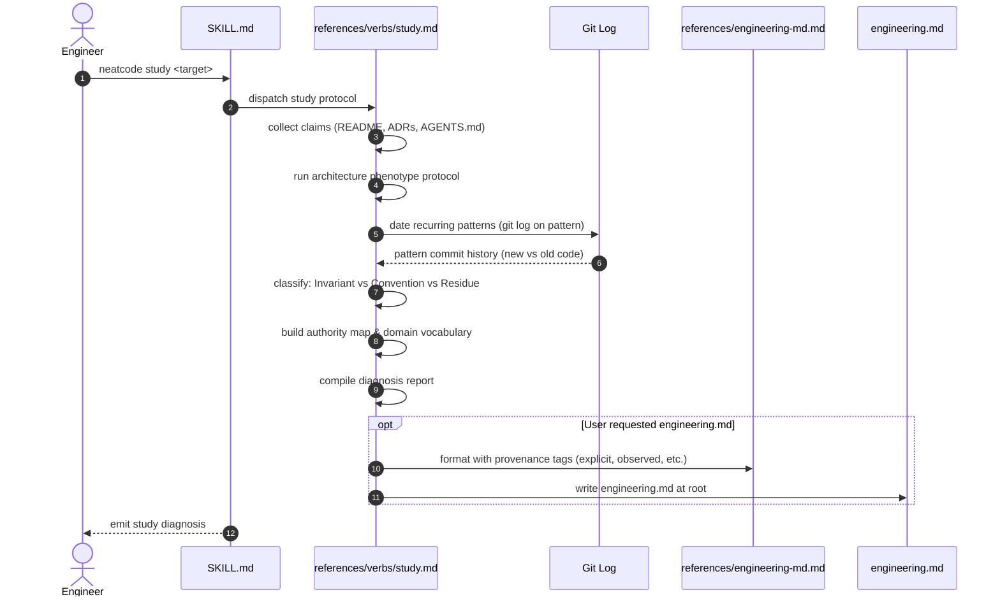

# Workflow: Studying Engineering DNA

This workflow details how the `neatcode study <target>` verb extracts a repository's engineering DNA and separates load-bearing invariants from conventions and historical residue.

---

## Summary
`neatcode study` answers *"what holds this system together and what rules govern it?"* Its primary discipline is **repetition is not intent**: a pattern repeated fifty times may be an invariant, a reasonable convention, or the fossil record of an old bad afternoon that everything since copied. It dates patterns using `git log`, inspects authority maps, and produces an actionable diagnosis, optionally synthesizing a portable `engineering.md`.

---

## Sequence Diagram

---

## Execution Stages

### 1. Scope & Claim Collection
Collects all stated intent: `README.md`, `ARCHITECTURE.md`, ADRs (`docs/adr/`), `AGENTS.md`, and manifests. ADRs are prioritized because they record decisions *and* rejected alternatives.

### 2. Phenotype Observation
Reads the repository's observable morphology and imports to determine conformance.

### 3. Date the Patterns (Separating Invariant from Residue)
To avoid laundering historical accidents into permanent architecture:
- **`git log` on the pattern**: Is the pattern present in modern code, or only in files untouched for three years? A pattern appearing in 2021 files and absent in 2025 code is **residue**.
- **Look for counterexamples**: A deliberate counterexample in recent code by an experienced maintainer proves the pattern is not an invariant.
- **Look for enforcement**: An invariant is enforced by a compiler type, a database constraint, or an architecture test. An unenforced rule that is universal is a **convention**. An unenforced inconsistent pattern is **residue**.
- **Detect half-migrations**: Two patterns solving the same problem, one growing and one shrinking, represents a migration in progress. Study identifies which side to build on.

### 4. Authority & Vocabulary Mapping
Identifies who owns each invariant and where state transitions take place. Documents ambiguous vocabulary terms.

### 5. Diagnosis & `engineering.md`
Outputs the 11 study deliverables (claims, implied conventions, structural patterns, dependency directions, authority, invariants, conventions, residue, debt, contradictions, unknowns). If requested, writes `engineering.md` with explicit provenance tags (`explicit`, `observed`, `inferred`, `disputed`, `unknown`).

---

## Source Trail
- [`skills/neatcode/references/verbs/study.md`](../../skills/neatcode/references/verbs/study.md) — Study verb specification.
- [`skills/neatcode/references/engineering-md.md`](../../skills/neatcode/references/engineering-md.md) — Portable engineering profile specification.
- [`docs/study-examples.md`](../study-examples.md) — Worked study extractions.
